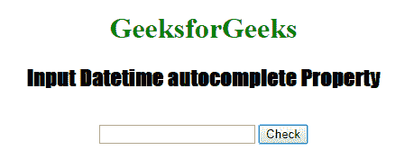
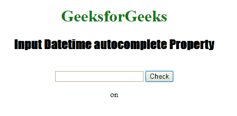
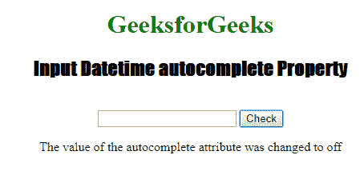

# HTML | DOM 输入日期时间自动完成属性

> 原文:[https://www . geesforgeks . org/html-DOM-input-datetime-autocomplete-property/](https://www.geeksforgeeks.org/html-dom-input-datetime-autocomplete-property/)

HTML DOM 中的**输入 Datetime 自动完成属性**用于设置或返回输入 Datetime 字段的自动完成属性值。自动完成属性用于指定自动完成属性的值是“开”还是“关”。当“自动完成”属性设置为“开”时，浏览器将根据用户之前输入的值自动完成。

**语法:**

*   它返回输入日期时间自动完成属性。

    ```html
    DatetimeObject.autocomplete
    ```

*   它用于设置输入日期时间自动完成属性。

    ```html
    DatetimeObject.autocomplete = "on|off" 
    ```

**属性值:**包含以下两个值:

*   **开:**为默认值。它会自动完成这些值。
*   **off:** 定义用户应填写 URL 输入字段的值。它不会自动完成这些值。

**返回值:**返回一个代表自动完成状态的字符串值。

**示例 1:** 本示例说明如何返回 Input Datetime 自动完成属性。

```html
<!DOCTYPE html> 
<html> 

<head> 
    <title> 
        HTML DOM Input Datetime autocomplete Property
    </title> 
</head> 

<body style="text-align:center;"> 

    <h1 style="color:green;">
        GeeksforGeeks
    </h1> 

    <h2 style="font-family: Impact;">
        Input Datetime autocomplete Property
    </h2> 
    <br> 

    <input type="datetime" id="test_Datetime"
            autocomplete="on"> 

    <button ondblclick="My_Datetime()"> 
        Check 
    </button> 

    <p id="test"></p> 

    <script> 
        function My_Datetime() { 

            // Return the Datetime autofocus
            // property value
            var d = document.getElementById(
                    "test_Datetime").autocomplete; 

            document.getElementById("test").innerHTML = d; 
        } 
    </script> 

</body> 

</html>
```

*   **点击按钮前:**
    
*   **点击按钮后:**
    

**示例 2:** 本示例说明如何设置输入日期时间自动完成属性。

```html
<!DOCTYPE html> 
<html> 

<head> 
    <title> 
        Input Datetime autocomplete Property in HTML 
    </title>
</head> 

<body style="text-align:center;"> 

    <h1 style="color:green;">
        GeeksforGeeks
    </h1> 

    <h2 style="font-family: Impact;">
        Input Datetime autocomplete Property
    </h2> 
    <br> 

    <input type="datetime" id="test_Datetime"
            autocomplete="on"> 

    <button ondblclick="My_Datetime()"> 
        Check 
    </button> 

    <p id="test"></p> 

    <script> 
        function My_Datetime() { 

            // Return the Datetime autofocus 
            // property Value. 
            var d = 
            document.getElementById( 
            "test_Datetime").autocomplete = "off"; 

            document.getElementById("test").innerHTML
                    = "The value of the autocomplete "
                    + "attribute was changed to " +d; 
        }
    </script> 
</body> 

</html>
```

*   **点击按钮前:**
    
*   **点击按钮后:**
    

**支持的浏览器:**HTML DOM 输入日期时间自动完成属性支持的浏览器如下:

*   谷歌 Chrome
*   微软公司出品的 web 浏览器
*   火狐浏览器
*   旅行队
*   歌剧