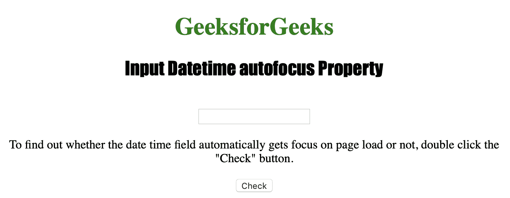
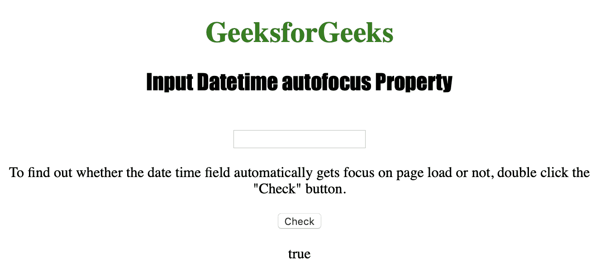
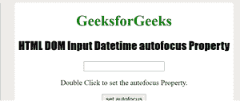
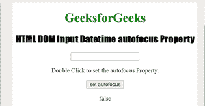

# HTML | DOM 输入日期时间自动对焦属性

> 原文:[https://www . geesforgeks . org/html-DOM-input-datetime-autofocus-property/](https://www.geeksforgeeks.org/html-dom-input-datetime-autofocus-property/)

**Datetime 自动对焦属性**用于**设置**或**返回**Datetime 字段的自动对焦。如果页面加载时 datetime 字段自动获得焦点，则 Datetime 自动对焦属性返回 true，否则返回 false。
HTML 自动对焦属性由 Datetime 自动对焦属性反映。
**语法:**

*   **返回自动对焦属性:**

```html
datetimeObject.autofocus
```

*   **设置自动对焦属性:**

```html
datetimeObject.autofocus = true|false
```

**房产价值:**

*   **true|false:** 用于指定页面加载时日期时间字段是否应该获得焦点。默认为假。

**返回值:**返回一个布尔值，该值指定 Datetime 字段是否自动对焦。

下面的程序说明了 DateTime 自动对焦属性:
**示例:**找出 Datetime 字段是否在页面加载时自动获得焦点。

## 超文本标记语言

```html
<!DOCTYPE html>
<html>

<head>
    <title>
      Input Datetime autofocus Property in HTML
  </title>
    <style>
        h1 {
            color: green;
        }

        h2 {
            font-family: Impact;
        }

        body {
            text-align: center;
        }
    </style>
</head>

<body>

    <h1>GeeksforGeeks</h1>
    <h2>Input Datetime autofocus Property</h2>
    <br>

    <input type="datetime" 
           id="test_Datetime"
           autofocus>

<p>To find out whether the date time field automatically
      gets focus on page load or not,
      double click the "Check" button.</p>

    <button ondblclick="My_Datetime()">
      Check
  </button>

    <p id="test">
  </p>

    <script>
        function My_Datetime() {

            // Return the Datetime autofocus
            // property Value.
            var d =
             document.getElementById(
              "test_Datetime").autofocus;

            document.getElementById("test").innerHTML = d;
        }
    </script>

</body>

</html>
```

**输出:**
**前:**



**之后:**



**示例-2:** 下面的代码设置自动对焦属性。

## 超文本标记语言

```html
<!DOCTYPE html>
<html>

<head>
    <title>
        HTML DOM Input Datetime autofocus Property
    </title>

    <style>
        h1 {
            color: green;
        }

        h2 {
            font-family: Impact;
        }

        body {
            text-align: center;
        }
    </style>
</head>

<body>
    <h1>GeeksforGeeks</h1>

    <h2>
        HTML DOM Input Datetime autofocus Property
    </h2>

    <input type="datetime"
        id="test" autofocus>

<p>Double Click to set the autofocus Property.</p>

    <button ondblclick="Access()">set autofocus</button>

    <p id="check"></p>

    <script>
        function Access() {

            // Accessing input element type value
            var a = document.getElementById(
                    "test").autofocus = "false";

            document.getElementById(
                    "check").innerHTML = a;
        }
    </script>

</body>

</html>
```

**输出:**
**前:**



**之后:**



**支持的浏览器:**

*   苹果 Safari
*   微软公司出品的 web 浏览器
*   火狐浏览器
*   谷歌 Chrome
*   歌剧