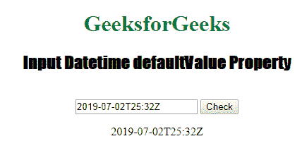

# HTML | DOM 输入日期时间默认值属性

> 原文:[https://www . geesforgeks . org/html-DOM-input-datetime-default value-property/](https://www.geeksforgeeks.org/html-dom-input-datetime-defaultvalue-property/)

HTML DOM 中的**输入日期时间默认值属性**用于设置或返回日期时间字段的默认值。此属性用于反映 HTML 值属性。默认值与值的主要区别在于，默认值表示属性的默认值，该值包含进行一些更改后的当前值。此属性用于查找日期字段是否已更改。
**语法:**

*   它用于返回 defaultValue 属性。

```html
datetimeObject.defaultValue
```

*   它用于设置 defaultValue 属性。

```html
datetimeObject.defaultValue = value
```

**属性值:**包含单个属性值 ***值*** ，定义输入日期时间字段的默认值。
**返回值:**返回代表输入日期时间字段默认值的字符串值。
**示例 1:** 本示例说明如何返回 Input Datetime defaultValue 属性。

## 超文本标记语言

```html
<!DOCTYPE html>
<html>

<head>
    <title>
        HTML DOM Input Datetime defaultValue Property
    </title>
</head>

<body style="text-align:center;">

    <h1 style="color: green;">
        GeeksforGeeks
    </h1>

    <h2 style="font-family: Impact;">
        Input Datetime defaultValue Property
    </h2>
    <br>

    <input type="datetime" id="test_Datetime"
        value="2019-07-02T25:32Z" autocomplete="on">

    <button ondblclick="My_Datetime()">
        Check
    </button>

    <p id="test"></p>

    <script>
        function My_Datetime() {

            // Return the Datetime autofocus
            // property Value.
            var d = document.getElementById(
                "test_Datetime").defaultValue;

            document.getElementById("test").innerHTML
                = d;
        }
    </script>
</body>

</html>          
```

**输出:**

*   **点击按钮前:**


*   **点击按钮后:**



**示例 2:** 本示例说明如何返回 Input datetime defaultValue 属性。

## 超文本标记语言

```html
<!DOCTYPE html>
<html>

<head>
    <title>
        HTML DOM Input Datetime defaultValue Property
    </title>
</head>

<body style="text-align:center;">

    <h1 style="color: green;">
        GeeksforGeeks
    </h1>

    <h2 style="font-family: Impact;">
        Input Datetime defaultValue Property
    </h2>
    <br>

    <input type="datetime" id="test_Datetime"
        value="2019-07-02T25:32Z" autocomplete="on">

    <button ondblclick="My_Datetime()">
        Check
    </button>

    <p id="test"></p>

    <script>
        function My_Datetime() {

            // Return the Datetime autofocus
            // property Value.
            var d = document.getElementById(
                    "test_Datetime").defaultValue
                    = "2015-01-02T11:42:13.510";

            document.getElementById("test").innerHTML
                    = "The value was changed to " + d;
        }
    </script>
</body>

</html>    
```

**输出:**

*   **点击按钮前:**


*   **点击按钮后:**


**支持的浏览器:****HTML DOM Input Datetime defaultValue Property**支持的浏览器如下:

*   谷歌 Chrome
*   微软公司出品的 web 浏览器
*   火狐浏览器
*   旅行队
*   歌剧