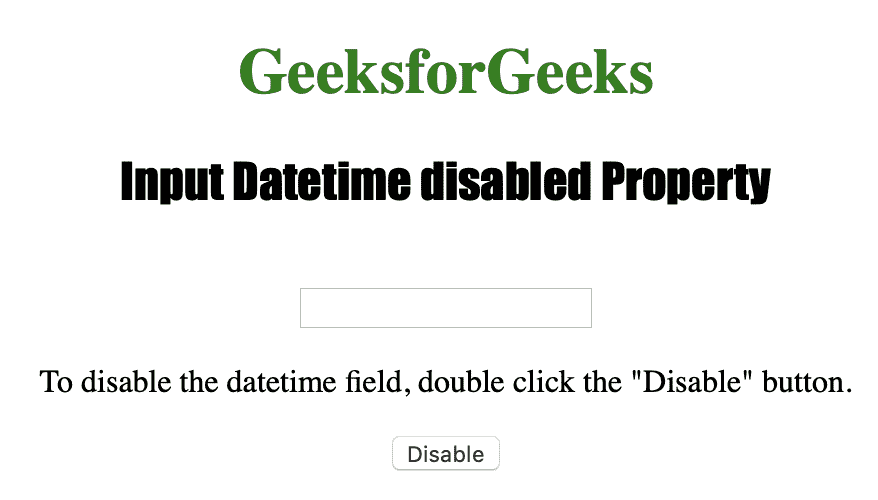

# HTML | DOM 输入日期时间禁用属性

> 原文:[https://www . geesforgeks . org/html-DOM-input-datetime-disabled-property/](https://www.geeksforgeeks.org/html-dom-input-datetime-disabled-property/)

**输入日期时间禁用属性**用于设置或返回日期时间字段是否应禁用。如果元素被禁用，它将变得不可用和不可点击。浏览器通常以灰色呈现这些元素。
HTML 禁用属性由 Datetime disabled 属性反映。
**语法:**
**返回禁用属性:**

```html
datetimeObject.disabled
```

**设置禁用属性:**

```html
datetimeObject.disabled = true|false
```

**房产价值:**

*   **true|false:** 用于指定是否禁用日期时间字段。默认为假。

**返回值:**它返回一个布尔值，指定日期时间字段是否被禁用。

下面的程序说明了禁用的日期时间属性:
**示例:**禁用日期时间字段。

## 超文本标记语言

```html
<!DOCTYPE html>
<html>

<head>
    <title>Input Datetime disabled Property in HTML
  </title>
    <style>
        h1 {
            color: green;
        }

        h2 {
            font-family: Impact;
        }

        body {
            text-align: center;
        }
    </style>
</head>

<body>

    <h1>GeeksforGeeks</h1>
    <h2> Input Datetime disabled Property </h2>
    <br>

    <input type="datetime"
           id="test_Datetime">

<p>To disable the datetime field,
      double click the "Disable" button.</p>

    <button ondblclick="My_Datetime()">
      Disable
  </button>

    <script>
        function My_Datetime() {

            // Set disabled=true.
            document.getElementById(
              "test_Datetime").disabled = true;
        }
    </script>

</body>

</html>
```

**输出:**
**初始:**



**点击禁用按钮前:**


**点击禁用按钮后:**


**支持的浏览器:**

*   苹果 Safari
*   微软公司出品的 web 浏览器
*   火狐浏览器
*   谷歌 Chrome
*   歌剧