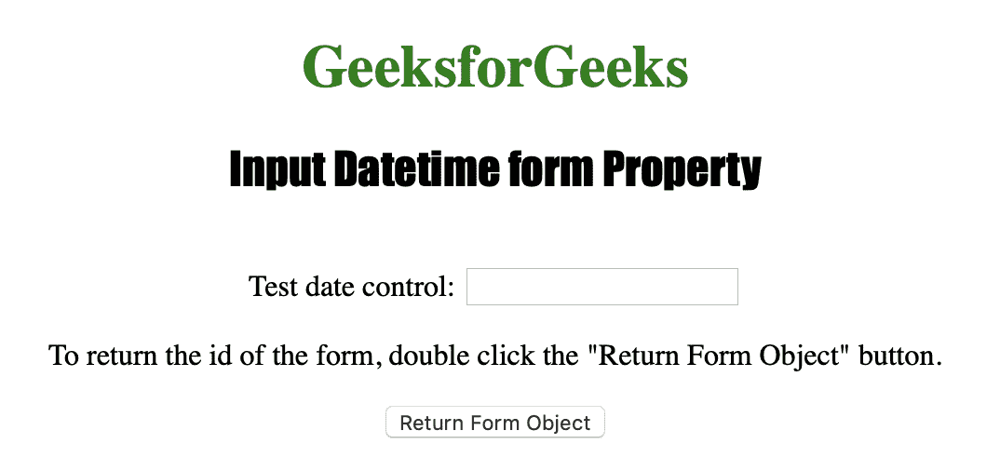
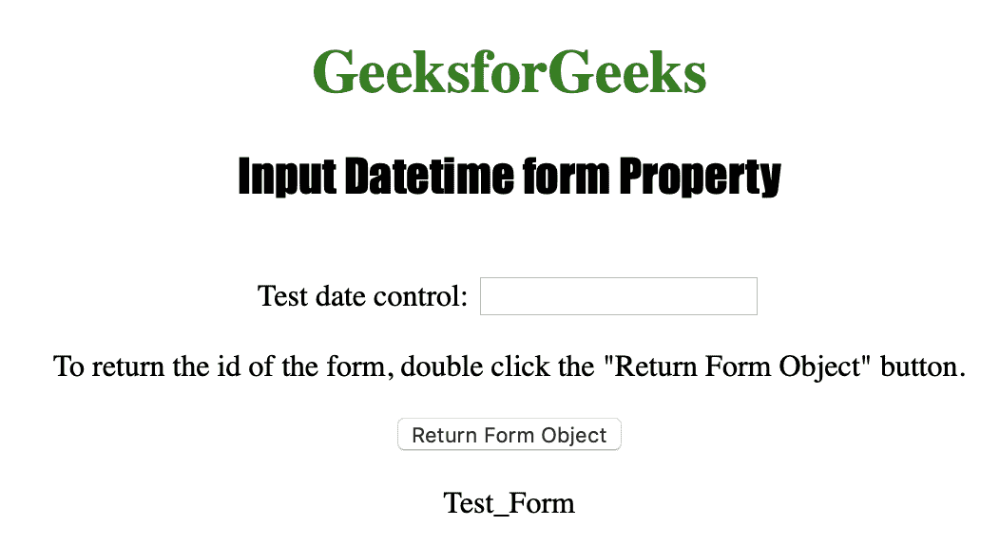

# HTML | DOM 输入日期时间表单属性

> 原文:[https://www . geesforgeks . org/html-DOM-input-datetime-form-property/](https://www.geeksforgeeks.org/html-dom-input-datetime-form-property/)

**输入 Datetime 表单属性**用于返回对包含 Datetime 字段的表单的引用。它是一个只读属性，在成功时返回一个表单对象，否则如果日期控件不在表单中，它将返回空值。
**语法:**

```html
datetimeObject.form
```

**返回值:**它返回一个字符串值，该值指定包含输入日期时间字段的表单的引用

下面的程序说明了 Datetime 表单属性:
**示例:**返回包含<输入类型=“Datetime”>元素的表单的 id。

## 超文本标记语言

```html
<!DOCTYPE html>
<html>

<head>
    <title>Input Datetime form Property in HTML
  </title>
    <style>
        h1 {
            color: green;
        }

        h2 {
            font-family: Impact;
        }

        body {
            text-align: center;
        }
    </style>
</head>

<body>

    <h1>GeeksforGeeks</h1>
    <h2>Input Datetime form Property</h2>
    <br>

    <form id="Test_Form">
        Test date control:
        <input type="datetime"
               id="Test_Datetime">
    </form>

<p>To return the id of the form, double
      click the "Return Form Object" button.</p>

    <button ondblclick="My_Datetime()">
      Return Form Object
  </button>

    <p id="test"></p>

    <script>
        function My_Datetime() {

            // Return form ID
            var d =
            document.getElementById("Test_Datetime").form.id;
            document.getElementById("test").innerHTML = d;
        }
    </script>

</body>

</html>
```

**输出:**
**点击按钮前:**



**点击按钮后:**



**支持的浏览器:**

*   苹果 Safari
*   微软公司出品的 web 浏览器
*   火狐浏览器
*   谷歌 Chrome
*   歌剧