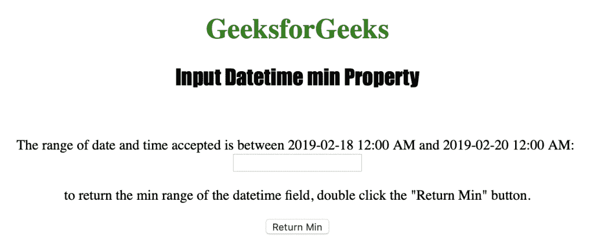
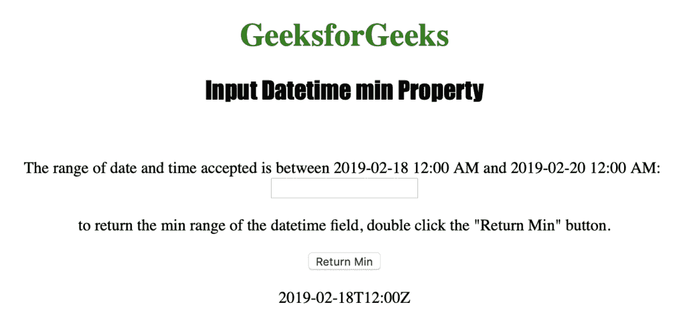
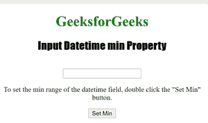
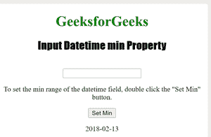

# HTML | DOM 输入日期时间最小属性

> 原文:[https://www . geesforgeks . org/html-DOM-input-datetime-min-property/](https://www.geeksforgeeks.org/html-dom-input-datetime-min-property/)

**输入日期时间最小值**属性用于设置或返回日期时间字段的最小值属性。
Input Datetime min 属性返回一个表示允许的最小日期和时间的字符串。

**语法:**

*   要返回最小属性:

```html
datetimeObject.min
```

*   要设置最小属性:

```html
datetimeObject.min = YYYY-MM-DDThh:mm:ssTZD
```

**属性值:**

*   **YYYY-MM-DDThh:mm:ssTZD :** 用于指定允许的最小日期和时间。
    *   YYYY:指定年份。
    *   MM:指定月份。
    *   DD:它指定了一个月中的某一天。
    *   如果还输入了时间，它会指定分隔符。
    *   hh:它指定了小时。
    *   它指定了分钟。
    *   ss:它指定了秒数。
    *   TZD:它指定了时区指示器。

**返回值:**返回一个字符串值，代表日期时间字段允许的最小日期和时间。

下面的程序说明了 DateTime Min 属性:
**示例 1:** 获取 DateTime 字段允许的最小日期和时间。

## 超文本标记语言

```html
<!DOCTYPE html>
<html>

<head>
    <title>Input Datetime min Property in HTML</title>
    <style>
        h1 {
            color: green;
        }

        h2 {
            font-family: Impact;
        }

        body {
            text-align: center;
        }
    </style>
</head>

<body>

    <h1>GeeksforGeeks</h1>
    <h2>Input Datetime min Property</h2>
    <br>

<p>The range of date and time accepted is between
      2019-02-18 12:00 AM and 2019-02-20 12:00 AM:</p>

     <input type="datetime" id="Test_Datetime"
             min="2019-02-18T12:00Z" max="2019-02-20T12:00Z">

<p>To return the min range of the datetime field,
                double click the "Return Min" button.</p>

        <button ondblclick="My_Datetime()">Return Min</button>

        <p id="test"></p>

        <script>
            function My_Datetime() {
                var d = document.getElementById("Test_Datetime").min;
                document.getElementById("test").innerHTML = d;
            }
        </script>

</body>

</html>

```

**输出:**
**前:**



**点击按钮后:**



**示例 2:** 设置输入日期时间最小值属性

## 超文本标记语言

```html
<!DOCTYPE html>
<html>

<head>
    <title>Input Datetime min Property in HTML</title>
    <style>
        h1 {
            color: green;
        }

        h2 {
            font-family: Impact;
        }

        body {
            text-align: center;
        }
    </style>
</head>

<body>

    <h1>GeeksforGeeks</h1>
    <h2>Input Datetime min Property</h2>
    <br>

     <input type="datetime" id="Test_Datetime"
             min="2019-02-18T12:00Z" max="2019-02-20T12:00Z">

<p>To set the min range of the datetime field,
                double click the "Set Min" button.</p>

        <button ondblclick="My_Datetime()">Set Min</button>

        <p id="test"></p>

        <script>
            function My_Datetime() {
                var d = document.getElementById("Test_Datetime").min =
                    "2018-02-13";
                document.getElementById("test").innerHTML = d;
            }
        </script>

</body>

</html>

```

**输出:**

**之前:**



**点击按钮后:**



**支持的网络浏览器**

*   苹果 Safari
*   微软公司出品的 web 浏览器
*   火狐浏览器
*   谷歌 Chrome
*   歌剧