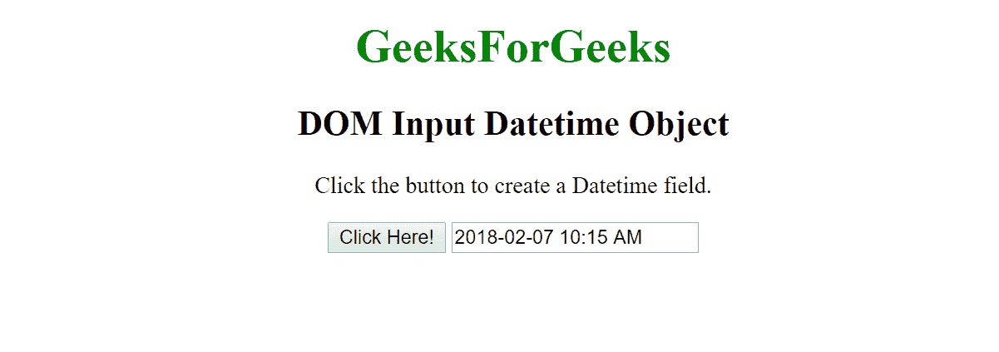

# HTML | DOM 输入日期时间对象

> 原文:[https://www . geesforgeks . org/html-DOM-input-datetime-object/](https://www.geeksforgeeks.org/html-dom-input-datetime-object/)

HTML DOM 中的**输入日期时间对象**用于表示带有**类型=“日期时间”**的 HTML 输入元素。使用 **getElementById()方法**可以访问带有**类型=“日期时间”**的输入元素。
**语法:**

*   它用于访问输入 Datetime 对象。

    ```html
    document.getElementById("id");
    ```

*   它用于创建输入元素。

    ```html
    document.createElement("input");
    ```

**输入日期时间对象属性:**

| 财产 | 描述 |
| 类型 | 此属性用于返回 Datetime 字段是哪种类型的表单元素。 |
| 价值 | 此属性用于设置或返回 Datetime 字段的 value 属性值。 |
| 自动完成 | 此属性用于设置或返回 Datetime 字段的自动完成属性的值。 |
| 自（动）调焦装置 | 此属性用于设置或返回 Datetime 字段，以便在页面加载时自动获得焦点。 |
| 缺省值 | 此属性用于设置或返回 Datetime 字段的默认值。 |
| 有缺陷的 | 此属性用于设置或返回 Datetime 字段是否被禁用。 |
| 形式 | 此属性用于返回对包含 Datetime 字段的表单的引用。 |
| 目录 | 此属性用于返回对包含 Datetime 字段的 datalist 的引用。 |
| 最大 | 此属性用于设置或返回 Datetime 字段的 max 属性的值。 |
| 部 | 此属性用于设置或返回 Datetime 字段的 min 属性值。 |
| 名字 | 此属性用于设置或返回 Datetime 字段的 name 属性的值。 |
| 占位符 | 此属性用于设置或返回 Datetime 字段的占位符属性的值。 |
| 只读的 | 此属性用于设置或返回 Datetime 字段是否为只读。 |
| 需要 | 此属性用于设置或返回在提交表单之前是否必须填写 Datetime 字段。 |
| 步骤 | 此属性用于设置或返回 Datetime 字段的 step 属性的值。 |

**输入日期时间对象方法:**

| 方法 | 描述 |
| 逐步下降() | 此方法用于将输入 Datetime 的值减少指定的数字。 |
| stepUp() | 此方法用于将输入 Datetime 的值增加指定的数字。 |

**示例-1:** 使用**文档返回日期时间**。

```html
<!DOCTYPE html>
<html>

<body>

    <body style="text-align:center;">

        <h1 style="color:green;">   
            GeeksForGeeks   
        </h1>

        <h2>DOM Input Datetime Object</h2>

        <input type="datetime" 
               id="myDatetime"
               value="2018-02-07 10:15 AM ">

        <p>Click the button to get the date and time of the datetime field.</p>

        <button onclick="myFunction()">
          Click Here!
      </button>

        <p id="demo"></p>

        <script>
            function myFunction() {

                // Get datetime value.
                var x =
                    document.getElementById(
                      "myDatetime").value;

                document.getElementById(
                  "demo").innerHTML = x;
            }
        </script>

    </body>

</html>
```

**输出:**

**之前点击按钮:**


**点击按钮后:**


**示例-2:** 创建**“日期时间”**元素

```html
<!DOCTYPE html>
<html>

<body style="text-align:center;">

    <h1 style="color:green;">   
            GeeksForGeeks   
        </h1>

    <h2>DOM Input Datetime Object</h2>

    <p>
      Click the button to create a Datetime field.
  </p>

    <button onclick="myFunction()">
      Click Here!
  </button>

    <script>
        function myFunction() {

            // Create datetime element and 
            // set attributes.
            var x = document.createElement("INPUT");

            x.setAttribute("type", "datetime");
            x.setAttribute("value", "2018-02-07 10:15 AM");
            document.body.appendChild(x);
        }
    </script>

</body>

</html>
```

**输出:**

**之前点击按钮:**


**点击按钮后:**


**支持的浏览器:**

*   谷歌 Chrome
*   Mozilla Firefox
*   边缘
*   旅行队
*   歌剧