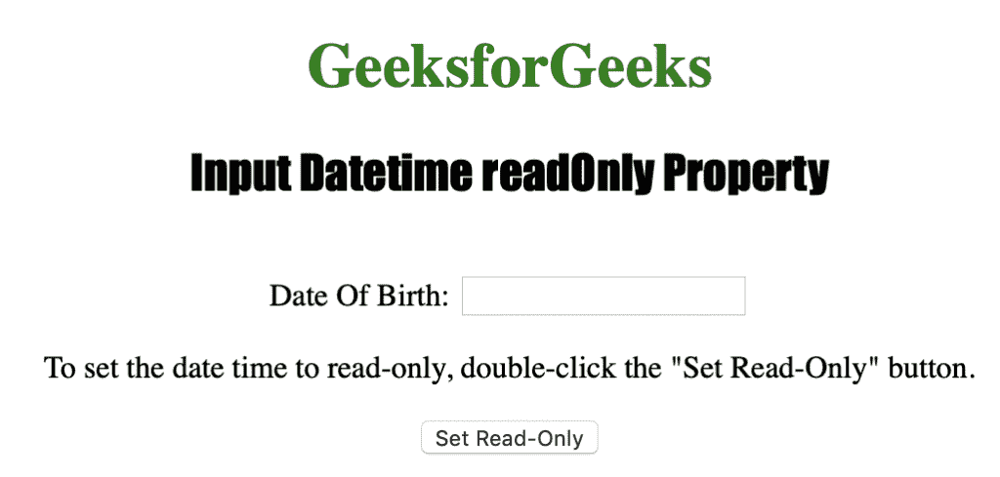
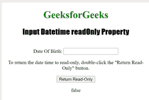

# HTML | DOM 输入日期时间只读属性

> 原文:[https://www . geesforgeks . org/html-DOM-input-datetime-readonly-property/](https://www.geeksforgeeks.org/html-dom-input-datetime-readonly-property/)

**输入日期时间只读**属性用于设置或返回日期时间字段是否应为只读。
只读字段可以加标签、高亮显示，并可用于复制文本，但不能进一步修改。输入日期时间只读属性反映了 HTML 只读属性。
**语法:**

*   用于返回只读属性

```html
datetimeObject.readOnly
```

*   用于设置只读属性:

```html
datetimeObject.readOnly = true|false
```

**房产价值**

*   **true|false :** 用于指定日期时间字段是否为只读。

**返回值:**返回一个布尔值，表示日期时间字段是否为只读。

下面的程序说明了 Datetime readOnly 属性:

**将日期时间字段设置为只读。**

## 超文本标记语言

```html
<!DOCTYPE html>
<html>

<head>
    <title>Input Datetime readOnly Property in HTML</title>
    <style>
        h1 {
            color: green;
        }

        h2 {
            font-family: Impact;
        }

        body {
            text-align: center;
        }
    </style>
</head>

<body>

    <h1>GeeksforGeeks</h1>
    <h2>Input Datetime readOnly Property</h2>
    <br> Date Of Birth:
    <input type="datetime" id="Test_Datetime" name="DOB">

<p>To set the date time to read-only,
      double-click the "Set Read-Only" button.</p>

    <button ondblclick="My_Datetime()">Set Read-Only</button>

    <p id="test"></p>

    <script>
        function My_Datetime() {
            document.getElementById("Test_Datetime").readOnly = true;
        }
    </script>

</body>

</html>                                         
```

**输出:**



**点击**按钮后


**返回日期时间字段的只读。**

## 超文本标记语言

```html
<!DOCTYPE html>
<html>

<head>
    <title>Input Datetime readOnly Property in HTML</title>
    <style>
        h1 {
            color: green;
        }

        h2 {
            font-family: Impact;
        }

        body {
            text-align: center;
        }
    </style>
</head>

<body>

    <h1>GeeksforGeeks</h1>
    <h2>Input Datetime readOnly Property</h2>
    <br> Date Of Birth:
    <input type="datetime" id="Test_Datetime" name="DOB">

<p>To return the date time to read-only,
      double-click the "Return Read-Only" button.</p>

    <button ondblclick="My_Datetime()">Return Read-Only</button>

    <p id="test"></p>

    <script>
        function My_Datetime() {
 var g = document.getElementById("Test_Datetime").readOnly;
     document.getElementById("test").innerHTML = g;

        }
    </script>

</body>

</html>                                         
```

**之前:**


**之后:**



**支持的网络浏览器**

*   苹果 Safari
*   微软公司出品的 web 浏览器
*   火狐浏览器
*   谷歌 Chrome
*   歌剧