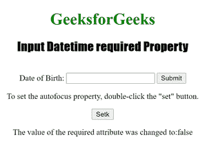

# HTML | DOM 输入所需的日期时间属性

> 原文:[https://www . geesforgeks . org/html-DOM-input-datetime-required-property/](https://www.geeksforgeeks.org/html-dom-input-datetime-required-property/)

输入**所需的日期时间**属性用于在提交表单之前检查日期时间字段是否必须填写。

**语法:**

*   要返回所需的属性:

```html
datetimeObject.required
```

*   要设置所需的属性:

```html
 datetimeObject.required = true|false 
```

**房产价值:**

*   **true|false :** 用于指定日期时间字段是否应该是表单提交的必需部分。

**返回值:**它返回一个布尔值，该值表示输入 Datetime 字段是否是必需的。

下面的程序说明了所需的 datetime 属性:
**示例 1:** 确定在提交表单之前是否必须填写 Datetime 字段。

## 超文本标记语言

```html
<!DOCTYPE html>
<html>

<head>
    <title>Input Datetime required Property in HTML</title>
    <style>
        h1 {
            color: green;
        }

        h2 {
            font-family: Impact;
        }

        body {
            text-align: center;
        }
    </style>
</head>

<body>

    <h1>GeeksforGeeks</h1>
    <h2>Input Datetime required Property</h2>
    <br>

    <form action="/initials.php">
        Date of Birth:
        <input type="datetime" id="Test_Datetime" name="DOB" required>
        <input type="submit">
    </form>

<p>To find out if the datetime field must be filled out before
        submitting the form, double-click the "Check" button.</p>

    <button ondblclick="My_Datetime()">Check</button>

    <p id="test"></p>

    <script>
        function My_Datetime() {
            var d = document.getElementById("Test_Datetime").required;
            document.getElementById("test").innerHTML = d;
        }
    </script>

</body>

</html>

```

**输出:**
**前:**


**点击按钮后:**


**示例 2:** 设置所需属性的值

## 超文本标记语言

```html
<!DOCTYPE html>
<html>

<head>
    <title>Input Datetime required Property in HTML</title>
    <style>
        h1 {
            color: green;
        }

        h2 {
            font-family: Impact;
        }

        body {
            text-align: center;
        }
    </style>
</head>

<body>

    <h1>GeeksforGeeks</h1>
    <h2>Input Datetime required Property</h2>
    <br>

    <form action="/initials.php">
        Date of Birth:
        <input type="datetime"
               id="Test_Datetime"
               name="DOB"
               required>
        <input type="submit">
    </form>

<p>To set the autofocus property,
      double-click the "set" button.</p>

    <button ondblclick="My_Datetime()">Setk</button>

    <p id="test"></p>

    <script>
        function My_Datetime() {
            var d = document.getElementById("Test_Datetime").required =
                "false";
            document.getElementById("test").innerHTML =
              "The value of the required attribute was changed to:" + d;
        }
    </script>

</body>

</html>

```

**输出:**

**之前:**


**点击按钮后:**



**支持的网络浏览器**

*   苹果 Safari
*   微软公司出品的 web 浏览器
*   火狐浏览器
*   谷歌 Chrome
*   歌剧