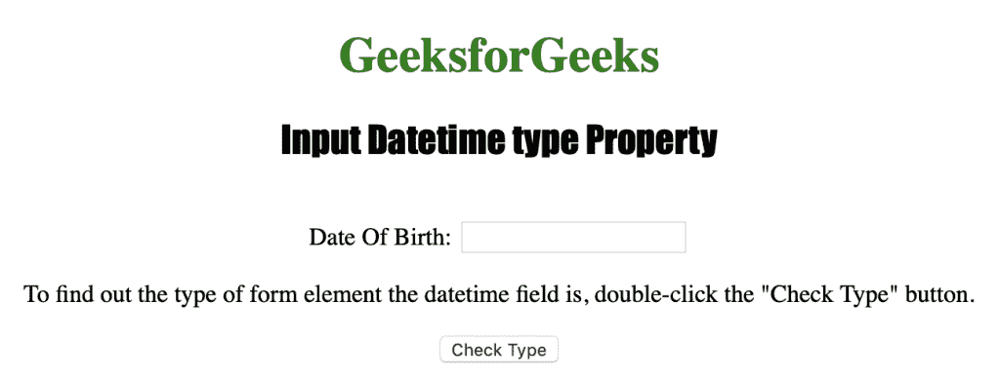
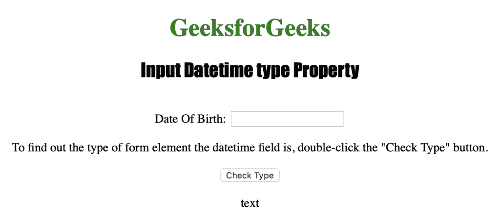

# HTML | DOM 输入日期时间类型属性

> 原文:[https://www . geesforgeks . org/html-DOM-input-datetime-type-property/](https://www.geeksforgeeks.org/html-dom-input-datetime-type-property/)

输入 datetime 类型属性用于返回 Datetime 字段的表单元素类型。
Input Datetime 类型属性返回一个字符串，该字符串表示 Datetime 字段的表单元素类型。
结果是像 Safari 和 Opera 这样的浏览器返回“日期时间”，而像 Internet Explorer、Firefox 和 Chrome 这样的浏览器返回“文本”。

**语法:**

```html
datetimeObject.type
```

**返回值**:返回一个字符串值，代表日期时间字段的表单元素类型

下面的程序说明了 datetime 类型属性:
**返回 Datetime 字段的表单元素类型。**

## 超文本标记语言

```html
<!DOCTYPE html>
<html>

<head>
    <title>Input Datetime type Property in HTML</title>
    <style>
        h1 {
            color: green;
        }

        h2 {
            font-family: Impact;
        }

        body {
            text-align: center;
        }
    </style>
</head>

<body>

    <h1>GeeksforGeeks</h1>
    <h2>Input Datetime type Property</h2>
    <br> Date Of Birth:
    <input type="datetime" id="Test_Datetime">

<p>To find out the type of form element the datetime field is,
      double-click the "Check Type" button.</p>

    <button ondblclick="My_Datetime()">Check Type</button>

    <p id="test"></p>

    <script>
        function My_Datetime() {
            var t = document.getElementById("Test_Datetime").type;
            document.getElementById("test").innerHTML = t;
        }
    </script>

</body>

</html>

```

**输出:**
**点击按钮前:**



**点击按钮后:**



**支持的网络浏览器:**

*   苹果 Safari
*   微软公司出品的 web 浏览器
*   火狐浏览器
*   谷歌 Chrome
*   歌剧