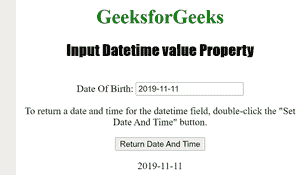

# HTML | DOM 输入日期时间值属性

> 原文:[https://www . geesforgeks . org/html-DOM-input-datetime-value-property/](https://www.geeksforgeeks.org/html-dom-input-datetime-value-property/)

输入日期时间值属性用于设置或返回日期时间字段的值属性的值。
输入日期时间值属性可用于为日期时间字段指定日期和时间。

**语法:**

*   对于返回值属性:

```html
datetimeObject.value
```

*   要设置 value 属性，请执行以下操作:

```html
datetimeObject.value = YYYY-MM-DDThh:mm:ssTZD
```

**属性值:**

*   **YYYY-MM-DDThh:mm:ssTZD:** 用于指定日期和/或时间。
    *   YYYY:指定年份。
    *   MM:指定月份。
    *   DD:它指定了一个月中的某一天。
    *   如果还输入了时间，它会指定分隔符。
    *   hh:它指定了小时。
    *   它指定了分钟。
    *   ss:它指定了秒数。
    *   TZD:它指定了时区指示器。

**返回值:**返回一个字符串值，代表 Datetime 字段的日期和时间值。

下面的程序说明了 Datetime 值属性:

**示例 1:** 返回日期时间字段的日期和时间值。**T3】**

## 超文本标记语言

```html
<!DOCTYPE html>
<html>

<head>
    <title>Input Datetime value Property in HTML</title>
    <style>
        h1 {
            color: green;
        }

        h2 {
            font-family: Impact;
        }

        body {
            text-align: center;
        }
    </style>
</head>

<body>

    <h1>GeeksforGeeks</h1>
    <h2>Input Datetime value Property</h2>
    <br> Date Of Birth:
    <input type="datetime" id="Test_Datetime" value="2019-11-11">

<p>To return a date and time for the datetime field,
    double-click the "Set Date And Time" button.</p>

    <button ondblclick="My_Datetime()">Return Date And Time</button>

    <p id="test"></p>

    <script>
        function My_Datetime() {
            var g = document.getElementById("Test_Datetime").value;
            document.getElementById("test").innerHTML = g;

        }
    </script>

</body>

</html>
```

**之前:**


**之后:**



**示例 2:** 为日期时间字段设置日期和时间。

## 超文本标记语言

```html
<!DOCTYPE html>
<html>

<head>
    <title>Input Datetime value Property in HTML</title>
    <style>
        h1 {
            color: green;
        }

        h2 {
            font-family: Impact;
        }

        body {
            text-align: center;
        }
    </style>
</head>

<body>

    <h1>GeeksforGeeks</h1>
    <h2>Input Datetime value Property</h2>
    <br> Date Of Birth:
    <input type="datetime" id="Test_Datetime">

<p>To set a date and time for the datetime field,
      double-click the "Set Date And Time" button.</p>

    <button ondblclick="My_Datetime()">Set Date And Time</button>

    <p id="test"></p>

    <script>
        function My_Datetime() {
            document.getElementById("Test_Datetime").value =
                                         "2019-02-04T12:32Z";
        }
    </script>

</body>

</html>

```

**输出:**


**点击**按钮后


**支持的网络浏览器:**

*   苹果 Safari
*   微软公司出品的 web 浏览器
*   火狐浏览器
*   谷歌 Chrome
*   歌剧