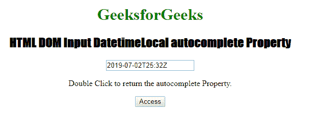
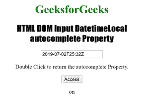
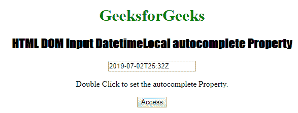
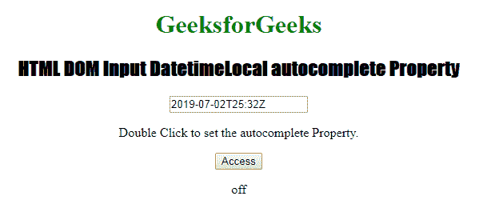

# HTML | DOM 输入日期时间本地自动完成属性

> 原文:[https://www . geesforgeks . org/html-DOM-input-datetime local-autocomplete-property/](https://www.geeksforgeeks.org/html-dom-input-datetimelocal-autocomplete-property/)

**输入日期时间本地自动完成属性**用于设置或返回输入日期时间本地字段的自动完成属性的值。自动完成属性用于指定自动完成属性的值是“开”还是“关”。当“自动完成”属性设置为“开”时，浏览器将根据用户之前输入的值自动完成。
**语法:**

*   它返回输入日期时间本地自动完成属性。

```html
DatetimeObject.autocomplete
```

*   它用于设置输入日期时间本地自动完成属性。

```html
DatetimeObject.autocomplete = "on|off" 
```

**属性值:**包含以下两个值:

*   **开:**为默认值。它会自动完成这些值。

*   **off:** 定义用户用 URL 输入字段填充值。它不会自动完成这些值。

**返回值:**返回一个代表自动完成状态的字符串值。
**示例 1:** 此示例说明如何返回 Input DatetimeLocal 自动完成属性。

## 超文本标记语言

```html
<!DOCTYPE html>
<html>

<head>
    <title>
        Input DatetimeLocal autocomplete Property
    </title>
    <style>
        h1 {
            color: green;
        }

        h2 {
            font-family: Impact;
        }

        body {
            text-align: center;
        }
    </style>
</head>

<body>
    <h1>GeeksforGeeks</h1>

    <h2>HTML DOM Input DatetimeLocal autocomplete Property</h2>

    <input type="datetime" autocomplete="on"
        id="test"
        value="2019-07-02T25:32Z" autofocus>

<p>Double Click to return the autocomplete Property.</p>

    <button ondblclick="Access()">Access</button>

    <p id="check"></p>

    <script>
        function Access() {

            // Accessing input element type value
            var a = document.getElementById(
                    "test").autocomplete;

            document.getElementById(
                    "check").innerHTML = a;
        }
    </script>

</body>

</html>                   
```

**输出:**

*   **点击按钮前:**



*   **点击按钮后:**



**示例 2:** 本示例说明如何设置 Input DatetimeLocal 自动完成属性。

## 超文本标记语言

```html
<!DOCTYPE html>
<html>

<head>
    <title>Input DatetimeLocal autocomplete property</title>
    <style>
        h1 {
            color: green;
        }

        h2 {
            font-family: Impact;
        }

        body {
            text-align: center;
        }
    </style>
</head>

<body>
    <h1>GeeksforGeeks</h1>

    <h2>HTML DOM Input DatetimeLocal autocomplete Property</h2>

    <input type="datetime" autocomplete="on"
        id="test"
        value="2019-07-02T25:32Z" autofocus>

<p>Double Click to set the autocomplete Property.</p>

    <button ondblclick="Access()">Access</button>

    <p id="check"></p>

    <script>
        function Access() {

            // Accessing input element type value
            var a = document.getElementById(
                    "test").autocomplete = "off";

            document.getElementById(
                    "check").innerHTML = a;
        }
    </script>
</body>

</html>                   
```

**输出:**

*   **点击按钮前:**



*   **点击按钮后:**



**支持的浏览器:**以下列出了 **HTML DOM Input DatetimeLocal 自动完成属性**支持的浏览器:

*   谷歌 Chrome
*   微软公司出品的 web 浏览器
*   火狐浏览器
*   苹果 Safari
*   歌剧