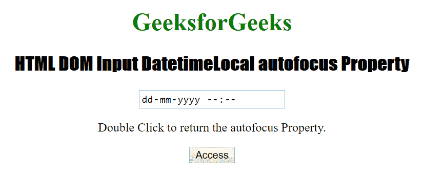

# HTML | DOM 输入日期时间本地自动对焦属性

> 原文:[https://www . geesforgeks . org/html-DOM-input-datetime local-autofocus-property/](https://www.geeksforgeeks.org/html-dom-input-datetimelocal-autofocus-property/)

HTML DOM 中的**输入日期时间本地自动对焦属性**用于设置或返回本地日期时间字段的自动对焦。如果本地日期时间字段在页面加载时自动获得焦点，则本地日期时间自动对焦属性返回 true，否则返回 false。HTML 自动对焦属性由 Datetime 自动对焦属性反映。

**语法:**

*   它返回自动对焦属性。

    ```html
    datetimelocalObject.autofocus
    ```

*   它设置自动对焦属性。

    ```html
    datetimelocalObject.autofocus = true | false
    ```

**属性值:**

*   **true|false:** It is used to specify whether a local datetime field should get focus when the page loads, or not.

    下面的程序说明了 DatetimeLocal 自动对焦属性:

    **示例 1:** 本示例返回输入日期时间本地自动对焦属性的值。

    ```html
    <!DOCTYPE html> 
    <html> 

    <head> 
        <title>
            HTML DOM Input DatetimeLocal autofocus Property
        </title> 

        <style> 
            h1 { 
                color: green; 
            } 

            h2 { 
                font-family: Impact; 
            } 

            body { 
                text-align: center; 
            } 
        </style> 
    </head> 

    <body> 
        <h1>GeeksforGeeks</h1> 

        <h2>
            HTML DOM Input DatetimeLocal autofocus Property
        </h2> 

        <input type="datetime-local"
            id="test" autofocus> 

        <p>
            Double Click to return the autofocus Property.
        </p> 

        <button ondblclick="Access()">Access</button> 

        <p id="check"></p> 

        <script> 
            function Access() { 

                // Accessing input element type value 
                var a = document.getElementById( 
                        "test").autofocus; 

                document.getElementById( 
                        "check").innerHTML = a; 
            } 
        </script> 
    </body> 

    </html>
    ```

    **输出:**

    *   **点击按钮前:**
        
    *   **点击按钮后:**
        

    **示例 2:** 本示例设置输入日期时间本地自动对焦属性的值。

    ```html
    <!DOCTYPE html> 
    <html> 

    <head> 
        <title>
            HTML DOM Input DatetimeLocal autofocus Property
        </title> 

        <style> 
            h1 { 
                color: green; 
            } 

            h2 { 
                font-family: Impact; 
            } 

            body { 
                text-align: center; 
            } 
        </style> 
    </head> 

    <body> 
        <h1>GeeksforGeeks</h1>

        <h2>
            HTML DOM Input DatetimeLocal autofocus Property
        </h2> 

        <input type="datetime-local"
            id="test" autofocus> 

        <p>Double Click to set the autofocus Property.</p> 

        <button ondblclick="Access()">Access</button> 

        <p id="check"></p> 

        <script> 
            function Access() { 

                // Accessing input element type value 
                var a = document.getElementById( 
                        "test").autofocus = "false"; 

                document.getElementById( 
                        "check").innerHTML = a; 
            } 
        </script> 

    </body> 

    </html>
    ```

    **输出:**

    *   **点击按钮前:**
        
    *   **点击按钮后:**
        

    **支持的浏览器:**以下列出了 **HTML DOM Input DatetimeLocal 自动对焦属性**支持的浏览器:

    *   谷歌 Chrome
    *   微软公司出品的 web 浏览器
    *   火狐浏览器
    *   苹果 Safari
    *   歌剧