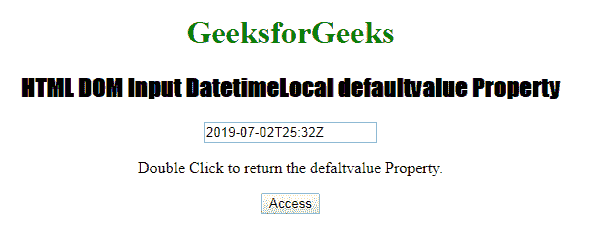
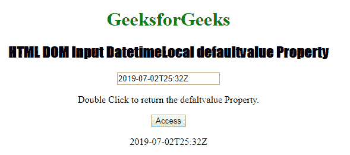
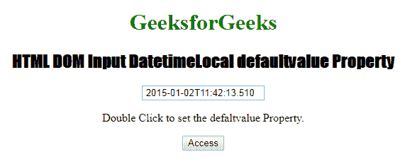
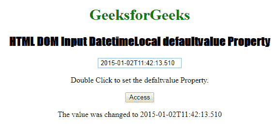

# HTML | DOM 输入日期时间本地默认值属性

> 原文:[https://www . geesforgeks . org/html-DOM-input-datetime local-defaultvalue-property/](https://www.geeksforgeeks.org/html-dom-input-datetimelocal-defaultvalue-property/)

**输入日期时间本地默认值属性**用于设置或返回本地日期时间字段的默认值。此属性用于反映 HTML 值属性。默认值与值的主要区别在于，默认值表示默认值，值包含进行一些更改后的当前值。该属性对于确定日期时间本地字段是否已被更改非常有用。
**语法:**

*   它用于返回 defaultValue 属性。

```html
datetimelocalObject.defaultValue
```

*   它用于设置 defaultValue 属性。

```html
datetimelocalObject.defaultValue = value
```

**属性值:**它包含定义本地日期时间字段默认值的单个属性“值”。
**返回值:**返回一个代表本地日期时间字段默认值的字符串值。
**示例 1:** 本示例说明如何返回 Input DatetimeLocal defaultValue 属性。

## 超文本标记语言

```html
<!DOCTYPE html>
<html>

<head>
    <title>Input DatetimeLocal defaultvalue Property</title>
    <style>
        h1 {
            color: green;
        }

        h2 {
            font-family: Impact;
        }

        body {
            text-align: center;
        }
    </style>
</head>

<body>
    <h1>GeeksforGeeks</h1>

    <h2>HTML DOM Input DatetimeLocal defaultvalue Property</h2>

    <input type="datetime-local" autocomplete="on"
        id="test"
        value="2019-07-02T25:32Z" autofocus>

<p>Double Click to return the defaultvalue Property.</p>

    <button ondblclick="Access()">Access</button>

    <p id="check"></p>

    <script>
        function Access() {

            // Accessing input element type value
            var a = document.getElementById(
                    "test").defaultValue;

            document.getElementById(
                    "check").innerHTML = a;
        }
    </script>
</body>

</html>                   
```

**输出:**

*   **点击按钮前:**



*   **点击按钮后:**



**示例 2:** 本示例说明如何设置 Input DatetimeLocal defaultValue 属性。

## 超文本标记语言

```html
<!DOCTYPE html>
<html>

<head>
    <title>Input DatetimeLocal defaultvalue Property</title>
    <style>
        h1 {
            color: green;
        }

        h2 {
            font-family: Impact;
        }

        body {
            text-align: center;
        }
    </style>
</head>

<body>
    <h1>GeeksforGeeks</h1>

    <h2>HTML DOM Input DatetimeLocal defaultvalue Property</h2>

    <input type="datetime-local" autocomplete="on"
        id="test"
        value="2019-07-02T25:32Z" autofocus>

<p>Double Click to set the defaultvalue Property.</p>

    <button ondblclick="Access()">Access</button>

    <p id="check"></p>

    <script>
        function Access() {

            // Accessing input element type value
            var a = document.getElementById(
            "test").defaultValue = " 2015-01-02T11:42:13.510";

            document.getElementById(
            "check").innerHTML = " The value was changed to " + a;
        }
    </script>

</body>

</html>                   
```

**输出:**

*   **点击按钮前:**



*   **点击按钮后:**



**支持的浏览器:**以下列出了**HTML DOM Input date time local default value Property**支持的浏览器:

*   谷歌 Chrome
*   微软公司出品的 web 浏览器
*   火狐浏览器
*   苹果 Safari
*   歌剧