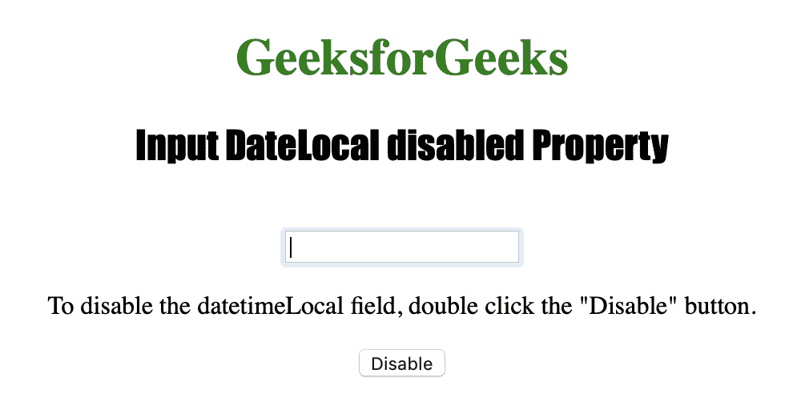
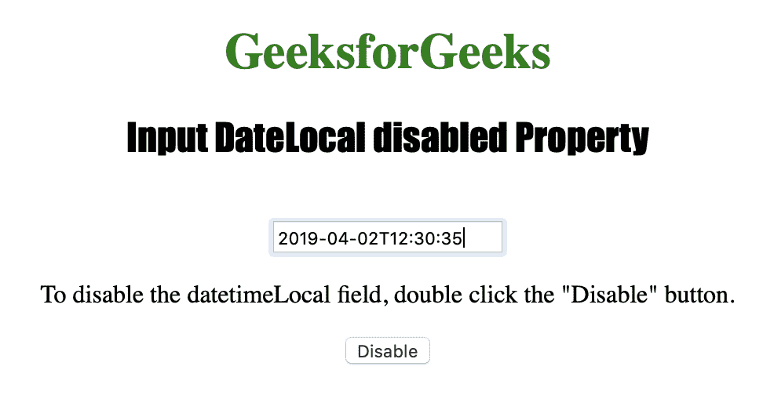
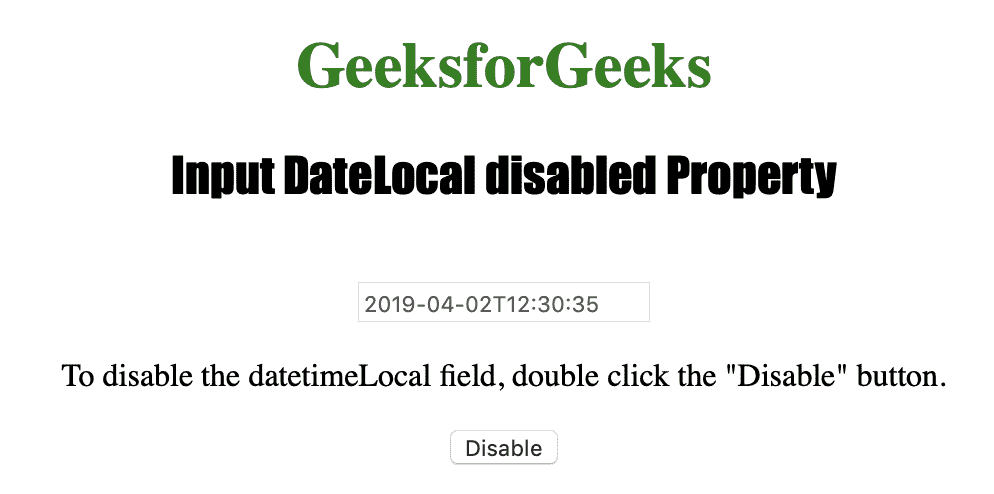

# HTML | DOM 输入日期时间本地禁用属性

> 原文:[https://www . geesforgeks . org/html-DOM-input-datetime local-disabled-property/](https://www.geeksforgeeks.org/html-dom-input-datetimelocal-disabled-property/)

HTML DOM 中的输入日期时间本地禁用属性用于设置或返回被禁用或未被禁用的本地日期时间字段。如果一个元素被禁用，那么它将变得不可用和不可点击。浏览器通常以灰色呈现这些元素。HTML 禁用属性由 DatetimeLocal disabled 属性反映。
**语法:**

*   它返回禁用的属性。

```html
inputdatetimelocalObject.disabled
```

*   它用于设置禁用属性。

```html
inputdatetimelocalObject.disabled = true|false
```

**属性值:**该属性包含单个属性值**真|假**。它用于指定是否应禁用本地日期时间字段。默认为假。
**返回值:**返回一个布尔值，该值代表日期时间本地字段是否被禁用。

下面的程序说明了 HTML DOM 中的 DatetimeLocal disabled 属性:
**示例:**本示例使用 Input DatetimeLocal disabled 属性来禁用输入日期时间。

## 超文本标记语言

```html
<!DOCTYPE html>
<html>

<head> 
    <title>
        Input DatetimeLocal disabled Property
    </title> 
</head>

<body style="text-align:center;">

    <h1 style="color:green;">
        GeeksforGeeks
    </h1> 

    <h2 style="font-family: Impact;">
        Input DateLocal disabled Property 
    </h2><br>

    <input type="datetime-local" id="test_DatetimeLocal">

<p>
        To disable the datetimeLocal field,
        double click the "Disable" button.
    </p>

    <button ondblclick="My_DatetimeLocal()">
        Disable
    </button>

    <!-- Script to disable input local datetime -->
    <script>
        function My_DatetimeLocal() {
            document.getElementById("test_DatetimeLocal").disabled
                    = true;
        }
    </script>
</body>

</html>                                                            
```

**输出:**



**点击禁用按钮前:**



**点击**禁用按钮后



**支持的浏览器:**输入日期时间本地禁用属性支持的浏览器如下:

*   苹果 Safari
*   微软公司出品的 web 浏览器
*   火狐浏览器
*   谷歌 Chrome
*   歌剧