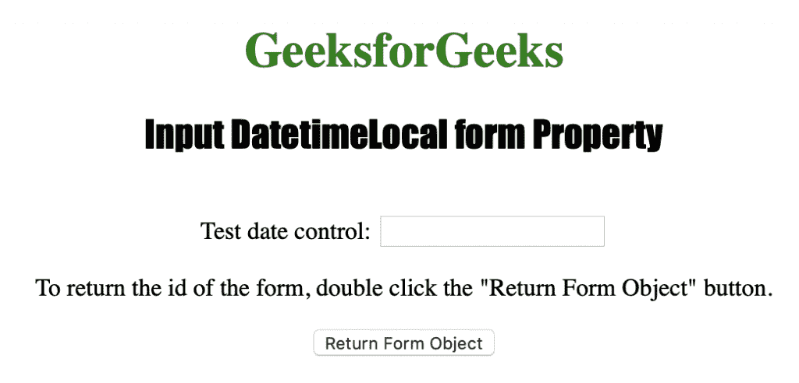
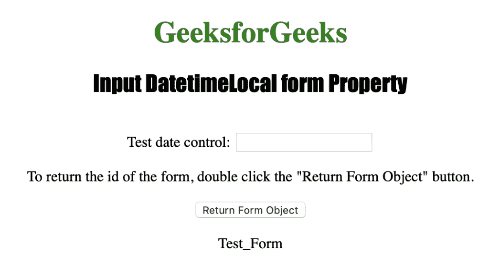

# HTML | DOM 输入日期时间本地表单属性

> 原文:[https://www . geesforgeks . org/html-DOM-input-datetime local-form-property/](https://www.geeksforgeeks.org/html-dom-input-datetimelocal-form-property/)

HTML DOM 中的输入日期时间本地表单属性用于返回对包含本地日期时间字段的表单的引用。它在成功时返回一个表单对象，否则如果日期控件不在表单中，它将返回空值。它是只读属性。
**语法:**

```html
datetimelocalObject.form
```

**返回值:**它返回一个字符串值，该值指定包含输入日期时间本地字段的表单的引用

下面的程序说明了 HTML DOM 中的 DatetimeLocal 表单属性:
**示例:**本示例返回包含<输入类型=“datetime-local”>元素的表单的 id。

## 超文本标记语言

```html
<!DOCTYPE html>
<html>

<head>
    <title>
        Input DatetimeLocal form Property
    </title>
</head>

<body style="text-align:center;">

    <h1 style="color:green;">
        GeeksforGeeks
    </h1>

    <h2 style="font-family: Impact;">
        Input DatetimeLocal form Property
    </h2><br>

    <form id="Test_Form">
        Test date control: <input type="datetime-local"
                id="Test_DatetimeLocal">
    </form>

<p>
        To return the id of the form, double click
        the "Return Form Object" button.
    </p>

    <button ondblclick="My_DatetimeLocal()">
        Return Form Object
    </button>

    <p id="test"></p>

    <!-- Script to return the form id -->
    <script>
        function My_DatetimeLocal() {
            var d = document.getElementById("Test_DatetimeLocal").form.id;
            document.getElementById("test").innerHTML = d;
        }
    </script>
</body>

</html>                                    
```

**输出:**
**点击按钮前:**



**点击**按钮后



**支持的浏览器:**输入日期时间本地表单属性支持的浏览器如下:

*   苹果 Safari
*   微软公司出品的 web 浏览器
*   火狐浏览器
*   谷歌 Chrome
*   歌剧