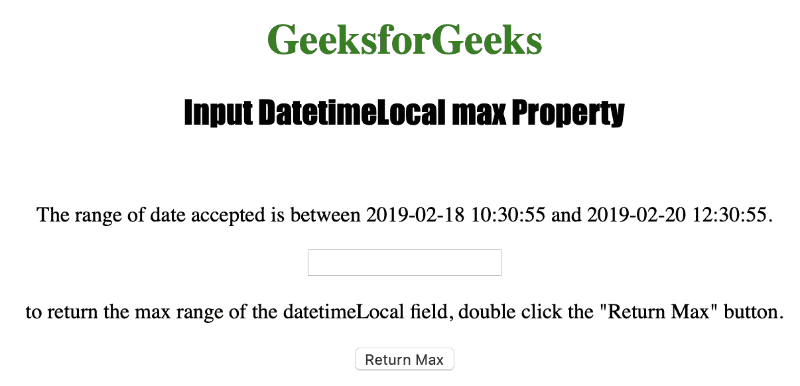
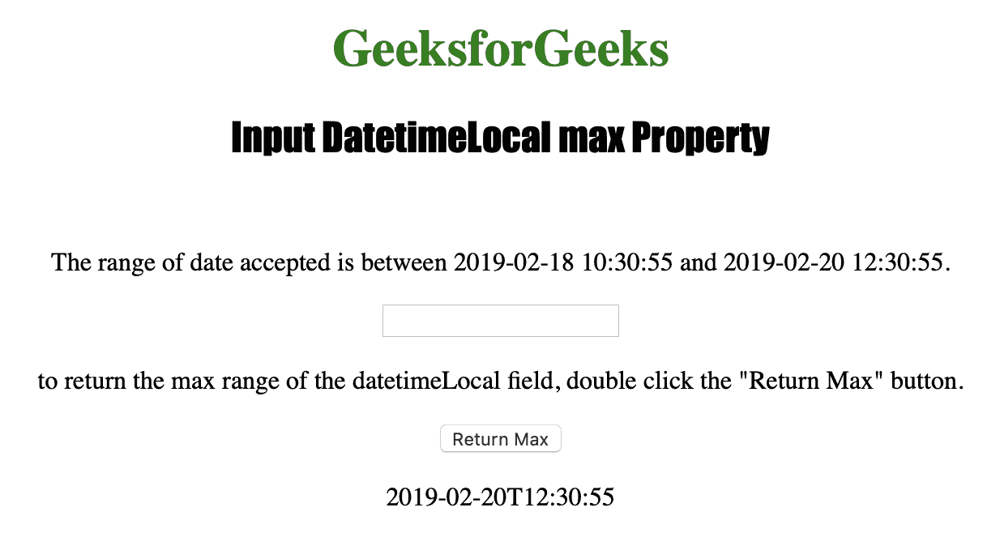

# HTML | DOM 输入日期时间本地最大属性

> 原文:[https://www . geesforgeks . org/html-DOM-input-datetime local-max-property/](https://www.geeksforgeeks.org/html-dom-input-datetimelocal-max-property/)

**输入日期时间本地最大属性**用于设置或返回本地日期时间字段的最大属性值。**输入日期时间本地最大属性**用于指定本地日期时间字段的日期和时间的最大值。
输入日期时间本地最大值属性返回一个字符串，代表允许的最大日期和时间。
**语法:**

*   **返回最大属性:**

```html
inputdatetimelocalObject.max
```

*   **设置最大属性:**

```html
inputdatetimelocalObject.max = YYYY-MM-DDThh:mm:ss.ms
```

**房产价值:**

*   **YYYY-MM-DDThh:mm:ssTZD:** 用于指定允许的最大日期和时间。
    *   YYYY:指定年份。
    *   MM:指定月份。
    *   DD:它指定了一个月中的某一天。
    *   如果还输入了时间，它会指定分隔符。
    *   hh:它指定了小时。
    *   它指定了分钟。
    *   ss:它指定了秒数。
    *   ms:它指定了微秒。

**返回值:**返回一个字符串值，代表输入日期时间本地字段的最大日期和时间。

下面的程序说明了 Datetimelocal max 属性:
**示例:**获取本地 DateTime 字段允许的最大日期和时间。

## 超文本标记语言

```html
<!DOCTYPE html>
<html>

<head>
    <title>
      Input DatetimeLocal max Property in HTML
  </title>
    <style>
        h1 {
            color: green;
        }

        h2 {
            font-family: Impact;
        }

        body {
            text-align: center;
        }
    </style>
</head>

<body>

    <h1>GeeksforGeeks
  </h1>
    <h2>Input DatetimeLocal max Property
  </h2>
    <br>

<p>The range of date accepted is
      between 2019-02-18 10:30:55 and
      2019-02-20 12:30:55.
  </p>

    <input type="datetime-local"
           id="Test_DatetimeLocal"
           min="2019-02-18T10:30:55"
           max="2019-02-20T12:30:55">

<p>to return the max range of the
      datetimeLocal field, double click the
      "Return Max" button.</p>

  <button ondblclick="My_DatetimeLocal()">
      Return Max
  </button>

    <p id="test"></p>

    <script>
        function My_DatetimeLocal() {
            var d = document.getElementById(
              "Test_DatetimeLocal").max;

            document.getElementById(
              "test").innerHTML = d;
        }
    </script>

</body>

</html>
```

**输出:**
**点击按钮前:**



**点击按钮后:**



**支持的浏览器:**

*   苹果 Safari
*   微软公司出品的 web 浏览器
*   火狐浏览器
*   谷歌 Chrome
*   歌剧