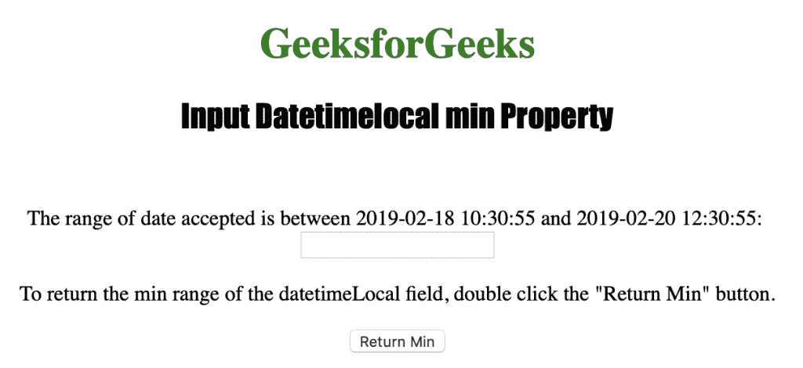
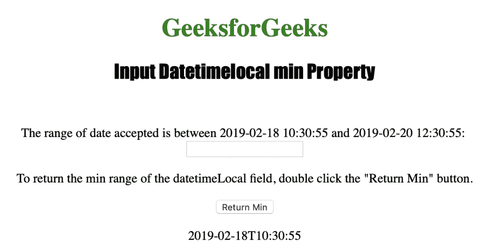

# HTML | DOM 输入日期时间本地最小属性

> 原文:[https://www . geesforgeks . org/html-DOM-input-datetime local-min-property/](https://www.geeksforgeeks.org/html-dom-input-datetimelocal-min-property/)

输入日期时间本地最小值属性用于设置或返回日期时间本地字段的最小值属性。它用于为日期时间本地字段指定日期和时间的最小值。它返回一个字符串，表示允许的最小日期和时间。

**语法:**

*   它返回输入日期时间本地最小值属性。

```html
inputdatetimelocalObject.min
```

*   它用于设置输入日期时间本地最小值属性。

```html
datetimelocalObject.min = YYYY-MM-DDThh:mm:ss.ms
```

**属性值:**接受属性值 **YYYY-MM-DDThh:mm:ssTZD** 。它用于指定允许的最小日期和时间。

*   YYYY:指定年份。
*   MM:指定月份。
*   DD:它指定了一个月中的某一天。
*   如果还输入了时间，它会指定分隔符。
*   hh:它指定了小时。
*   它指定了分钟。
*   ss:它指定了秒数。
*   ms:它指定毫秒。

**返回值:**返回一个字符串值，代表 datetimeLocal 字段的最小日期和时间。

下面的程序说明了 HTML DOM 中的 DatetimeLocal min 属性:

**示例:**本示例返回 datetimeLocal 字段允许的最小日期时间。

## 超文本标记语言

```html
<!DOCTYPE html>
<html>

<head>
    <title>
        Input Datetimelocal min Property in HTML
    </title>
</head>

<body style="text-align:center;">

    <h1 style="color:green;">
        GeeksforGeeks
    </h1>
    <h2 style="font-family: Impact;">
        Input Datetimelocal min Property
    </h2><br>

<p>
        The range of date accepted is between 2019-02-18
        10:30:55 and 2019-02-20 12:30:55.
    </p>

    <input type="datetime-local" id="Test_DatetimeLocal"
        min="2019-02-18T10:30:55" max="2019-02-20T12:30:55">

<p>
        To return the min range of the datetimeLocal
        field, double click the "Return Min" button.
    </p>

    <button ondblclick="My_DatetimeLocal()">
        Return Min
    </button>

    <p id="test"></p>

    <!-- Script to return Input Datetimelocal
        min property value -->
    <script>
        function My_DatetimeLocal() {
            var d = document.getElementById("Test_DatetimeLocal").min;
            document.getElementById("test").innerHTML = d;
        }
    </script>
</body>

</html>                                                    
```

**输出:**
**点击按钮前:**



**点击按钮后:**



**支持的浏览器:**输入日期时间本地最小值属性支持的浏览器如下:

*   苹果 Safari
*   微软公司出品的 web 浏览器
*   火狐浏览器
*   谷歌 Chrome
*   歌剧