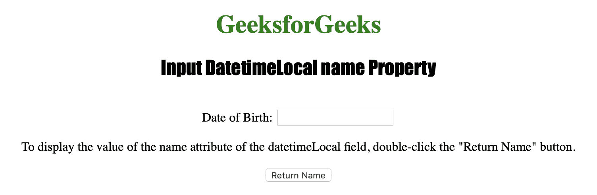
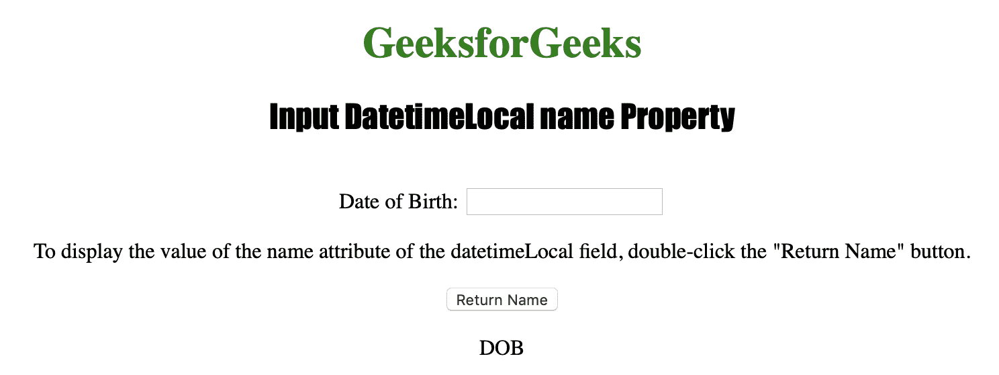

# HTML | DOM 输入日期时间本地名称属性

> 原文:[https://www . geesforgeks . org/html-DOM-input-datetime local-name-property/](https://www.geeksforgeeks.org/html-dom-input-datetimelocal-name-property/)

**输入日期时间本地名称属性**用于设置或返回日期时间本地字段的名称属性值。
已经提交给服务器的表单数据可以通过名称属性来识别。name 属性还用于在客户端使用 Javascript 引用表单数据。
**语法:**

*   **返回名称属性:**

```html
datetimelocalObject.name
```

*   **设置名称属性:**

```html
datetimelocalObject.name
```

**房产价值**

*   **名称:**用于指定 datetimeLocal 字段的名称。

**返回值:**返回一个字符串值，代表日期字段的名称。

下面的程序说明了 DatetimeLocal name 属性:
**示例:**获取 DatetimeLocal 字段的名称。

## 超文本标记语言

```html
<!DOCTYPE html>
<html>

<head>
    <title>
    Input DatetimeLocal name Property in HTML
  </title>

  <style>
        h1 {
            color: green;
        }

        h2 {
            font-family: Impact;
        }

        body {
            text-align: center;
        }
    </style>
</head>

<body>

    <h1>GeeksforGeeks</h1>
    <h2>
      Input DatetimeLocal name Property
  </h2>

  <br> Date of Birth:
  <input type="datetime-local"
         id="Test_DatetimeLocal"
         name="DOB">

<p>To display the value of the name
    attribute of the datetimeLocal
    field, double-click the
    "Return Name" button.
  </p>

    <button ondblclick="My_DatetimeLocal()">
      Return Name
  </button>

    <p id="test"></p>

    <script>
        function My_DatetimeLocal() {

          var n = document.getElementById(
              "Test_DatetimeLocal").name;

            document.getElementById(
              "test").innerHTML = n;
        }
    </script>

</body>

</html>
```

**输出:**
**点击按钮前:**



**点击按钮后:**



**支持的浏览器:**

*   苹果 Safari
*   微软公司出品的 web 浏览器
*   火狐浏览器
*   谷歌 Chrome
*   歌剧