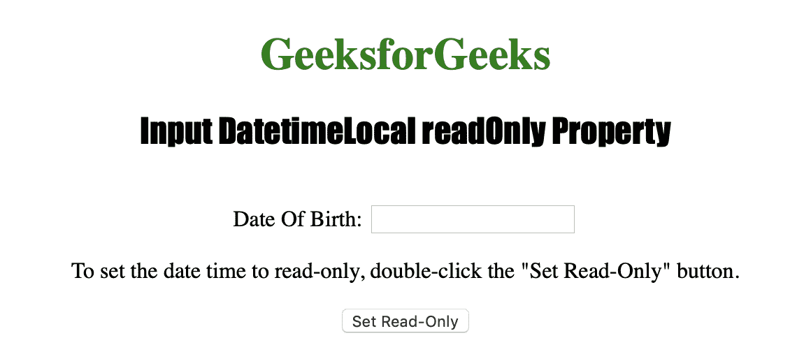
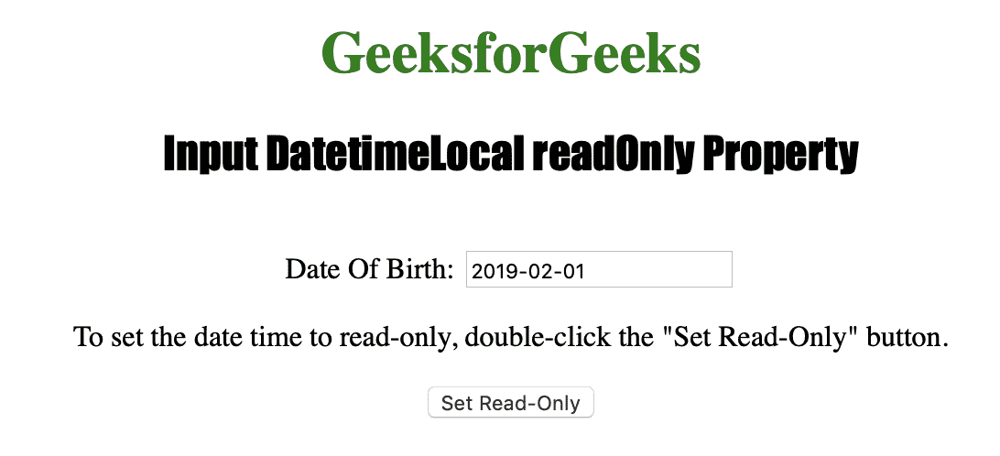

# HTML | DOM 输入日期时间本地只读属性

> 原文:[https://www . geesforgeks . org/html-DOM-input-datetime local-readonly-property/](https://www.geeksforgeeks.org/html-dom-input-datetimelocal-readonly-property/)

**输入日期时间本地只读属性**用于设置或返回日期时间本地字段是否应为只读。一旦字段被声明为只读，就不能再对其进行修改。但是，只读字段可以是选项卡式的、高亮显示的，并可用于复制文本。
HTML 只读属性由输入日期时间本地只读属性反映。
**语法:**

*   **返回只读属性:**

```html
datetimelocalObject.readOnly
```

*   **设置只读属性:**

```html
datetimelocalObject.readOnly = true|false
```

**房产价值:**

*   **true|false :** 用于指定 datetimeLocal 字段是否为只读。

**返回值:**它返回一个布尔值，该值表示日期时间本地字段是否是必需的。

下面的程序说明了 DatetimeLocal readOnly 属性:
**示例:**将 DatetimeLocal 字段设置为只读。

## 超文本标记语言

```html
<!DOCTYPE html>
<html>

<head>
    <title>
      Input DatetimeLocal
      readOnly Property in HTML
  </title>
    <style>
        h1 {
            color: green;
        }

        h2 {
            font-family: Impact;
        }

        body {
            text-align: center;
        }
    </style>
</head>

<body>

    <h1>GeeksforGeeks</h1>
    <h2>
      Input DatetimeLocal readOnly Property
  </h2>
    <br> Date Of Birth:

    <input type="datetime-local"
           id="Test_DatetimeLocal"
           name="DOB">

<p>
      To set the date time to read-only,
      double-click the "Set Read-Only" button.
  </p>

    <button ondblclick="My_DatetimeLocal()">
      Set Read-Only
  </button>

    <script>
        function My_DatetimeLocal() {
            document.getElementById(
              "Test_DatetimeLocal").readOnly =
              true;
        }
    </script>

</body>

</html>
```

**输出:**



**点击**按钮后



**支持的浏览器:**

*   苹果 Safari
*   微软公司出品的 web 浏览器
*   火狐浏览器
*   谷歌 Chrome
*   歌剧