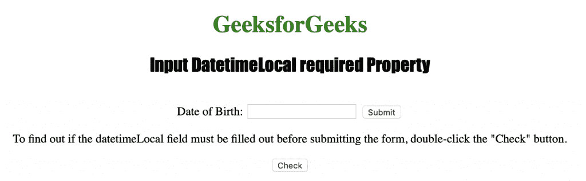
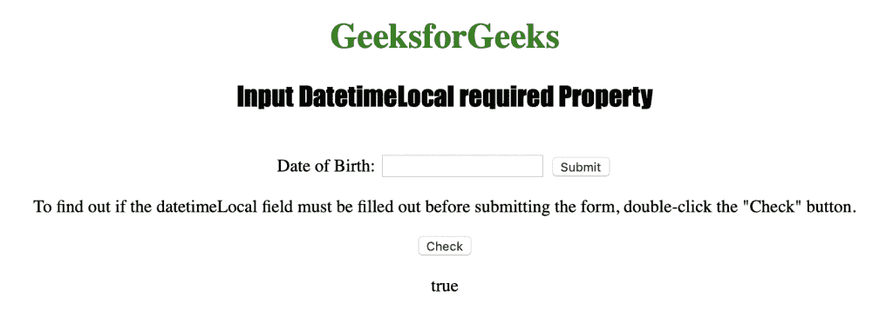

# HTML | DOM 输入日期时间本地必需属性

> 原文:[https://www . geesforgeks . org/html-DOM-input-datetime local-required-property/](https://www.geeksforgeeks.org/html-dom-input-datetimelocal-required-property/)

输入日期时间本地必需属性用于设置或返回在提交表单之前是否必须填写日期时间本地字段。
HTML required 属性用于反映 Input DatetimeLocal required 属性。
**语法:**

*   用于返回所需属性

```html
datetimelocalObject.required
```

*   用于设置所需属性

```html
 datetimelocalObject.required = true|false 
```

**房产价值:**

*   **true|false :** 用于指定 datetimeLocal 字段是否应该是表单提交的必需部分。默认为假。

**返回值:**它返回一个布尔值，指定本地日期时间字段是否是必需的。

下面的程序说明了所需的 DatetimeLocal 属性:
**在提交表单之前，确定是否必须填写 datetimeLocal 字段。**T3】

## 超文本标记语言

```html
<!DOCTYPE html>
<html>

<head>
    <title>Input DatetimeLocal required Property in HTML</title>
    <style>
        h1 {
            color: green;
        }

        h2 {
            font-family: Impact;
        }

        body {
            text-align: center;
        }
    </style>
</head>

<body>

    <h1>GeeksforGeeks</h1>
    <h2>Input DatetimeLocal required Property</h2>
    <br>

    <form action="/initials.php">
        Date of Birth:
        <input type="datetime-local" id="Test_DatetimeLocal" name="DOB" required>
        <input type="submit">
    </form>

<p>To find out if the datetimeLocal field must be filled out
      before submitting the form, double-click the "Check" button.</p>

    <button ondblclick="My_DatetimeLocal()">Check</button>

    <p id="test"></p>

    <script>
        function My_DatetimeLocal() {
            var d = document.getElementById("Test_DatetimeLocal").required;
            document.getElementById("test").innerHTML = d;
        }
    </script>

</body>

</html>

```

**输出:**



**点击按钮后:**



**支持的网络浏览器:**

*   苹果 Safari
*   微软公司出品的 web 浏览器
*   火狐浏览器
*   谷歌 Chrome
*   歌剧