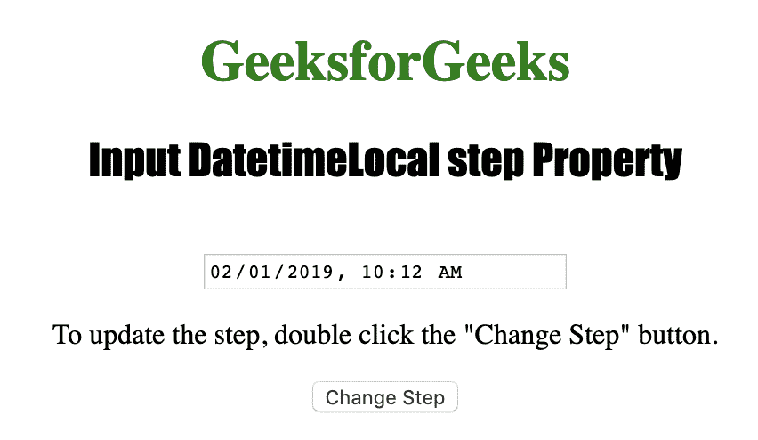
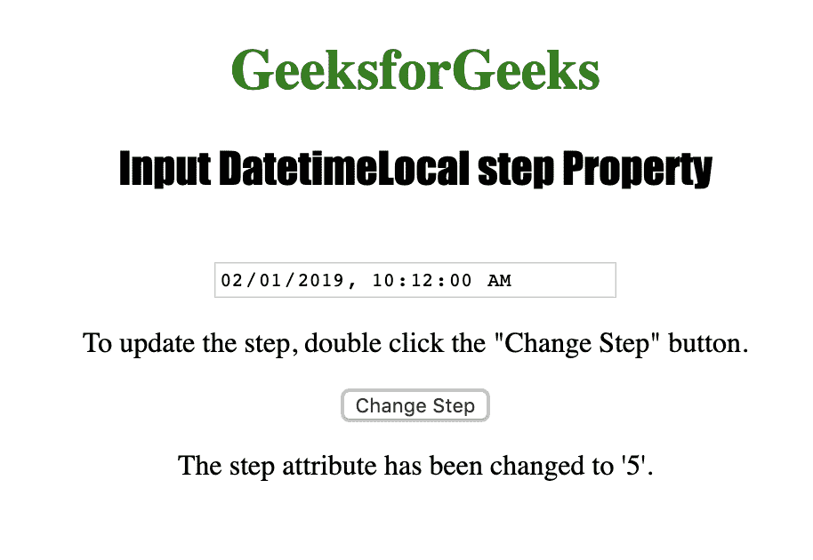

# HTML | DOM 输入日期时间本地步骤属性

> 原文:[https://www . geesforgeks . org/html-DOM-input-datetime local-step-property/](https://www.geeksforgeeks.org/html-dom-input-datetimelocal-step-property/)

HTML DOM 中的**输入日期时间本地步骤属性**用于设置或返回本地日期时间字段的步骤属性的值。输入步骤属性可用于在本地日期时间字段中指定秒或毫秒的合法数字间隔。step 属性不能用于影响天、月、年、小时或分钟。
**语法:**

*   它返回输入日期时间本地步骤属性。

```html
datetimelocalObject.step
```

*   它用于设置输入日期时间本地步骤属性。

```html
datetimelocalObject.step = number
```

**属性值:**包含单个属性值**数字**，用于指定秒或毫秒的法定数字间隔。
**返回值:**返回一个数值，代表以秒或毫秒为单位的合法间隔数。

下面的程序说明了 HTML DOM 中的 DatetimeLocal step 属性:
**示例:**本示例更改了本地日期字段中的法定秒数间隔。

## 超文本标记语言

```html
<!DOCTYPE html>
<html>

<head>
    <title>
        HTML DOM Input DatetimeLocal step Property
    </title>
</head>

<body style="text-align:center;">

    <h1 style="color:green;">
        GeeksforGeeks
    </h1>

    <h2 style="font-family: Impact;">
        Input DatetimeLocal step Property
    </h2>

    <input type="datetime-local" id="Test_Datetime">

<p>
        To update the step, double click
        the "Change Step" button.
    </p>

    <button ondblclick="My_DatetimeLocal()">
        Change Step
    </button>

    <p id="test"></p>

    <script>
        function My_DatetimeLocal() {
            document.getElementById("Test_Datetime").step
                    = "5";

            document.getElementById("test").innerHTML
                    = "The step attribute has been "
                      + "changed to '5'.";
        }
    </script>
</body>

</html>                                               
```

**输出:**
**点击按钮前:**



**点击按钮后:**



**支持的浏览器:**由*输入日期时间本地步骤属性*支持的浏览器如下:

*   苹果 Safari
*   Internet Explorer 10.0
*   火狐浏览器
*   谷歌 Chrome
*   歌剧