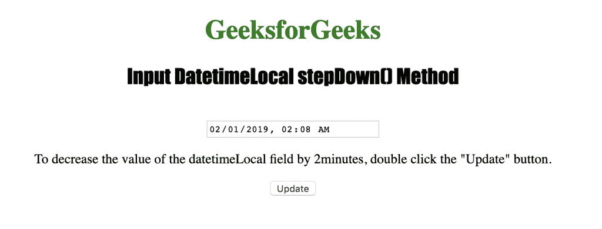
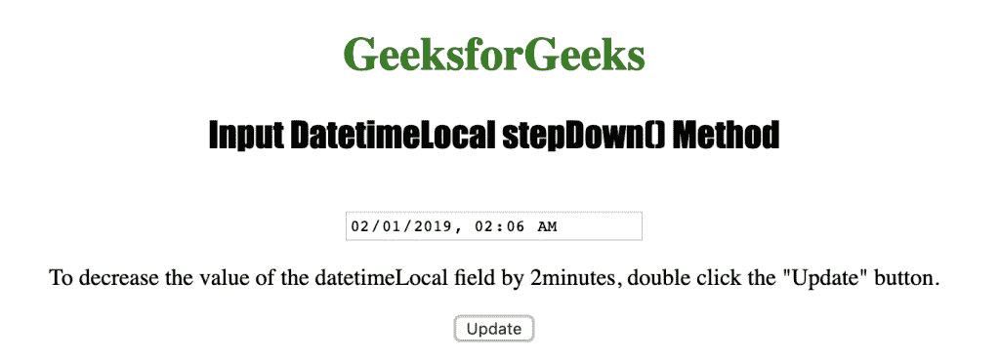

# HTML | DOM 输入日期时间本地降压()方法

> 原文:[https://www . geesforgeks . org/html-DOM-input-datetime local-step down-method/](https://www.geeksforgeeks.org/html-dom-input-datetimelocal-stepdown-method/)

HTML DOM 中的 **Input DatetimeLocal stepDown()方法**用于将 Local datetime 字段的值递减一个指定的数字。它只能在会议记录上使用。年、月、日、小时、秒或毫秒不受 stepDown()方法的影响。

**语法**

```html
datetimelocalObject.stepDown(number)
```

**参数:**包含单个参数**数字**，用于指定本地日期时间字段应减少的分钟数。

下面的程序说明了在 HTML DOM 中的日期时间本地步降方法:

**示例:**本示例使用 stepDown()方法将分钟值减少 2。

```html
<!DOCTYPE html>
<html>

<head> 
    <title>
        Input DatetimeLocal stepDown() Method
    </title> 
</head>

<body style="text-align:center;">

    <h1 style="color:green;">
        GeeksforGeeks
    </h1> 

    <h2 style="font-family: Impact;">
        Input DatetimeLocal stepDown() Method
    </h2>

    <input type="datetime-local" id="test_DatetimeLocal">

    <p>
        To decrease the value of the datetimeLocal field
        by 2minutes, double click the "Update" button.
    </p>

    <button ondblclick="My_DatetimeLocal()">
        Update
    </button>

    <!-- Script to use stepDown() method -->
    <script>
        function My_DatetimeLocal() {
            document.getElementById("test_DatetimeLocal").stepDown(2);
        }
    </script>
</body>

</html>                    
```

**输出:**


**点击**
按钮后

**支持的浏览器:**下面列出了*输入法*支持的浏览器:

*   苹果 Safari
*   Internet Explorer 12.0
*   谷歌 Chrome
*   歌剧