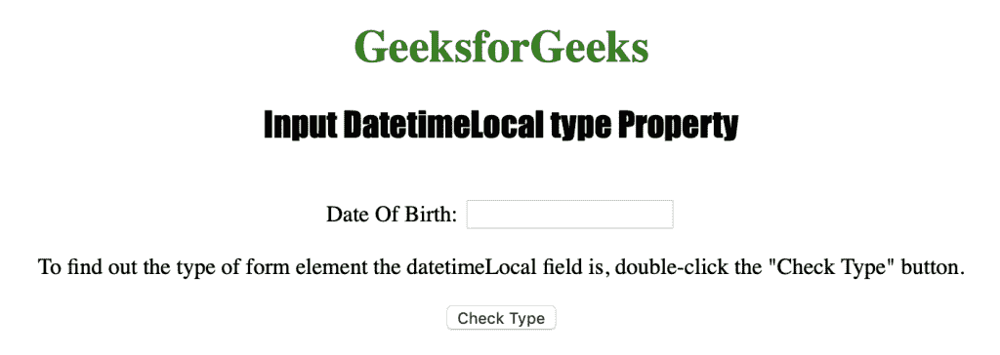
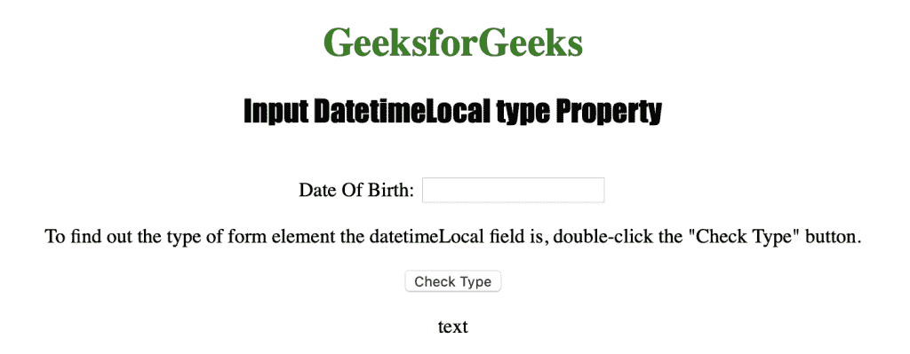

# HTML | DOM 输入日期时间本地类型属性

> 原文:[https://www . geesforgeks . org/html-DOM-input-datetime local-type-property/](https://www.geeksforgeeks.org/html-dom-input-datetimelocal-type-property/)

输入日期时间本地类型属性用于返回日期时间本地字段的表单元素类型。
输入日期时间本地类型属性返回一个字符串，该字符串表示日期时间本地字段的表单元素类型。
结果，像 Safari 和 Opera 这样的浏览器返回“日期时间-本地”，而像 Internet Explorer、Firefox 和 Chrome 这样的浏览器返回“文本”。

**语法**

```html
datetimelocalObject.type
```

**返回值**:返回一个字符串值，代表 DateTimeLocal 字段的表单元素类型。

下面的程序说明了日期时间本地类型属性:
**返回日期时间本地字段的表单元素类型。**

## 超文本标记语言

```html
<!DOCTYPE html>
<html>

<head>
    <title>Input DatetimeLocal type Property in HTML</title>
    <style>
        h1 {
            color: green;
        }

        h2 {
            font-family: Impact;
        }

        body {
            text-align: center;
        }
    </style>
</head>

<body>

    <h1>GeeksforGeeks</h1>
    <h2>Input DatetimeLocal type Property</h2>
    <br> Date Of Birth:
    <input type="datetime-local" id="Test_DatetimeLocal">

<p>To find out the type of form element the datetimeLocal field
        is, double-click the "Check Type" button.</p>

    <button ondblclick="My_DatetimeLocal()">Check Type</button>

    <p id="test"></p>

    <script>
        function My_DatetimeLocal() {
            var t = document.getElementById("Test_DatetimeLocal").type;
            document.getElementById("test").innerHTML = t;
        }
    </script>

</body>

</html>

```

**输出:**
**点击按钮前:**



**点击按钮后:**



**支持的网络浏览器:**

*   苹果 Safari
*   微软公司出品的 web 浏览器
*   火狐浏览器
*   谷歌 Chrome
*   歌剧