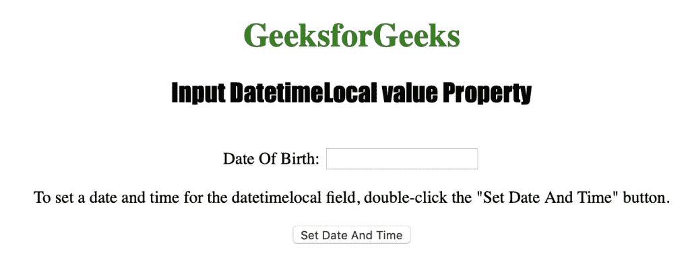
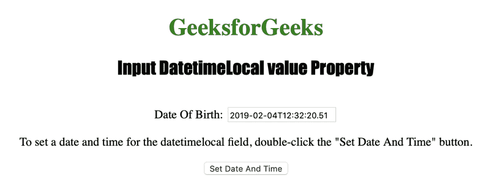

# HTML | DOM 输入日期时间本地值属性

> 原文:[https://www . geesforgeks . org/html-DOM-input-datetime local-value-property/](https://www.geeksforgeeks.org/html-dom-input-datetimelocal-value-property/)

输入日期时间本地值属性用于设置或返回日期时间本地字段的值属性的值。
输入日期时间本地值属性可用于指定日期时间本地字段的日期和时间。
**语法:**

*   用于返回值属性:

```html
datetimelocalObject.value
```

*   用于设置值属性:

```html
datetimelocalObject.value = YYYY-MM-DDThh:mm:ss.ms
```

**房产价值:**

*   **YYYY-MM-DDThh:mm:ssTZD :** 用于指定日期和/或时间。
    *   YYYY:指定年份。
    *   MM:指定月份。
    *   DD:它指定了一个月中的某一天。
    *   如果还输入了时间，它会指定分隔符。
    *   hh:它指定了小时。
    *   它指定了分钟。
    *   ss:它指定了秒数。
    *   ms:它指定毫秒。

**返回值:**返回一个字符串值，代表输入本地日期时间字段的日期和时间。

elow 程序说明了 DatetimeLocal 值属性:
**为 datetimeLocal 字段设置日期和时间。**T3】

## 超文本标记语言

```html
<!DOCTYPE html>
<html>

<head>
    <title>Input DatetimeLocal value Property in HTML</title>
    <style>
        h1 {
            color: green;
        }

        h2 {
            font-family: Impact;
        }

        body {
            text-align: center;
        }
    </style>
</head>

<body>

    <h1>GeeksforGeeks</h1>
    <h2>Input DatetimeLocal value Property</h2>
    <br> Date Of Birth:
    <input type="datetime-local" id="Test_DatetimeLocal">

<p>To set a date and time for the datetimeLocal field,
      double-click the "Set Date And Time" button.</p>

    <button ondblclick="My_DatetimeLocal()">Set Date And Time</button>

    <p id="test"></p>

    <script>
        function My_DatetimeLocal() {
            document.getElementById("Test_DatetimeLocal").value
                                      = "2019-02-04T12:32:20.51";
        }
    </script>

</body>

</html>

```

**输出:**



**点击按钮后:**



**支持的网络浏览器:**

*   苹果 Safari
*   微软公司出品的 web 浏览器
*   火狐浏览器
*   谷歌 Chrome
*   歌剧