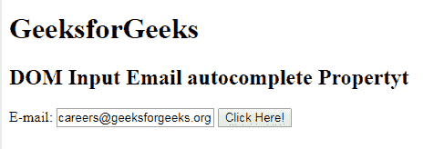
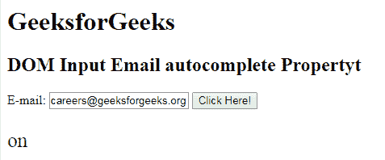
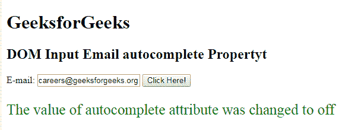

# HTML | DOM 输入电子邮件自动完成属性

> 原文:[https://www . geesforgeks . org/html-DOM-input-email-autocomplete-property/](https://www.geeksforgeeks.org/html-dom-input-email-autocomplete-property/)

HTML DOM 中的**输入电子邮件自动完成属性**用于设置或返回输入电子邮件字段的自动完成属性的值。自动完成属性用于指定自动完成属性的值是“开”还是“关”。当浏览器上的自动完成属性设置为时，将自动完成用户之前输入的值。

**语法:**

*   它返回输入电子邮件自动完成属性。

    ```html
    emailObject.autocomplete
    ```

*   它用于设置输入电子邮件自动完成属性。

    ```html
    emailObject.autocomplete = "on|off"
    ```

**属性值:**包含以下两个值:

*   **开:**为默认值。它会自动完成这些值。
*   **off:** 定义用户填写邮件输入字段的值。它不会自动完成这些值。

**返回值:**返回一个代表自动完成属性状态的字符串值。

**示例 1:** 本示例说明如何返回输入电子邮件自动完成属性。

```html
<!DOCTYPE html> 
<html> 

<head> 
    <title> 
        HTML DOM Input Email autocomplete Property
    </title> 
</head>     

<body> 

    <h1> GeeksforGeeks</h1> 

    <h2>DOM Input Email autocomplete Property</h2> 

    E-mail: <input type="email" id="email"
            value="careers@geeksforgeeks.org" autocomplete="on"> 

    <button onclick="myGeeks()"> 
        Click Here! 
    </button> 

    <p id="GFG" style="font-size:25px;color:green;"></p> 

    <!-- Script to use Input Email autocomplete Property -->
    <script> 
        function myGeeks() { 
            var em = document.getElementById("email").autocomplete; 
            document.getElementById("GFG").innerHTML = em; 
        } 
    </script> 
</body> 

</html>                    
```

**输出:**
**点击按钮前:**

**点击按钮后:**


**示例 2:** 本示例说明如何设置输入电子邮件自动完成属性。

```html
<!DOCTYPE html> 
<html> 

<head> 
    <title> 
        HTML DOM Input Email autocomplete Property
    </title> 
</head>     

<body> 

    <h1> GeeksforGeeks</h1> 

    <h2>DOM Input Email autocomplete Property</h2> 

    E-mail: <input type="email" id="email"
            value="careers@geeksforgeeks.org" autocomplete="on"> 

    <button onclick="myGeeks()"> 
        Click Here! 
    </button> 

    <p id="GFG" style="font-size:25px;color:green;"></p> 

    <!-- Script to use Input Email autocomplete Property -->
    <script> 
        function myGeeks() { 
            var em = document.getElementById("email").autocomplete
                    = "off"; 

            document.getElementById("GFG").innerHTML
                    = "The value of autocomplete attribute"
                      + " was changed to " + em; 
        } 
    </script> 
</body> 

</html>                    
```

**输出:**
**点击按钮前:**

**点击按钮后:**


**支持的浏览器:**T2 DOM 输入邮件自动完成属性支持的浏览器如下:

*   谷歌 Chrome
*   Internet Explorer 10.0
*   火狐浏览器
*   歌剧
*   旅行队