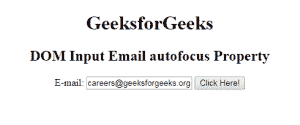
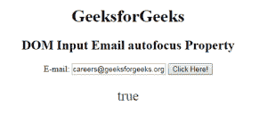
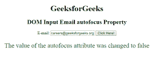

# HTML | DOM 输入邮件自动对焦属性

> 原文:[https://www . geesforgeks . org/html-DOM-input-email-autofocus-property/](https://www.geeksforgeeks.org/html-dom-input-email-autofocus-property/)

HTML DOM 中的**输入邮件自动对焦属性**用于设置或返回页面加载时输入邮件字段是否应该对焦。它反映了 HTML 自动对焦属性。

**语法:**

*   它返回自动对焦属性。

    ```html
    emailObject.autofocus
    ```

*   它用于设置自动对焦属性。

    ```html
    emailObject.autofocus = "true|false"
    ```

**属性值:**

*   **true:** 设置邮件字段的焦点
*   **false:** It has the default value. It defines the email field does not get focus

    。

**返回值:**返回一个布尔值，代表邮件字段是否自动对焦。

**示例:**本示例返回输入电子邮件自动对焦属性。

```html
<!DOCTYPE html> 
<html> 

<head> 
    <title> 
        HTML DOM Input Email autofocus Property
    </title> 
</head>     

<body> 

    <h1> GeeksforGeeks</h1> 

    <h2>DOM Input Email autofocus Propertyt</h2> 

    E-mail: <input type="email" id="email"
            value="careers@geeksforgeeks.org" autofocus> 

    <button onclick="myGeeks()"> 
        Click Here! 
    </button> 

    <p id="GFG" style="font-size:25px;color:green;"></p> 

    <!-- Script to access input element with 
            type email attribute -->
    <script> 
        function myGeeks() { 
            var em = document.getElementById("email").autofocus;
            document.getElementById("GFG").innerHTML = em; 
        } 
    </script> 
</body> 

</html>                    
```

**输出:**
**点击按钮前:**

**点击按钮后:**


**示例 2:** 本示例设置输入电子邮件自动对焦属性。

```html
<!DOCTYPE html> 
<html> 

<head> 
    <title> 
        HTML DOM Input Email autofocus Property
    </title> 
</head>     

<body style="text-align:center;">

    <h1> GeeksforGeeks</h1> 

    <h2>DOM Input Email autofocus Property</h2> 

    E-mail: <input type="email" id="email"
            value="careers@geeksforgeeks.org" autofocus> 

    <button onclick="myGeeks()"> 
        Click Here! 
    </button> 

    <p id="GFG" style="font-size:25px;color:green;"></p> 

    <!-- Script to access input element with 
            type email attribute -->
    <script> 
        function myGeeks() { 
            var em = document.getElementById("email").autofocus
                    = "false" 
            document.getElementById("GFG").innerHTML
                    = "The value of the autofocus attribute"
                      + " was changed to " + em; 
        } 
    </script> 
</body> 

</html>                    
```

**输出:**
**点击按钮前:**

**点击按钮后:**


**支持的浏览器:**T2 DOM 输入邮件自动对焦属性支持的浏览器如下:

*   谷歌 Chrome
*   微软公司出品的 web 浏览器
*   火狐浏览器
*   歌剧
*   旅行队