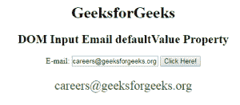

# HTML | DOM 输入电子邮件默认值属性

> 原文:[https://www . geesforgeks . org/html-DOM-input-email-default value-property/](https://www.geeksforgeeks.org/html-dom-input-email-defaultvalue-property/)

HTML DOM 中的**输入邮件默认值属性**用于设置或返回邮件字段的默认值。此属性用于反映 HTML 值属性。默认值和 value 属性之间的主要区别在于，默认值表示属性中指定的默认值，而该值在进行一些更改后包含当前值。当我们想知道电子邮件字段是否已被更改时，此属性很有用。

**语法:**

*   它用于返回 defaultValue 属性。

    ```html
    emailObject.defaultValue
    ```

*   它用于设置 defaultValue 属性。

    ```html
    emailObject.defaultValue = value
    ```

**属性值:**包含单个属性值**值**，定义邮件字段的默认值。

**返回值:**返回一个代表电子邮件字段默认值的字符串值。

**示例 1:** 本示例返回输入电子邮件默认值属性。

```html
<!DOCTYPE html> 
<html> 

<head> 
    <title> 
        HTML DOM Input Email defaultValue Property
    </title> 
</head>     

<body style="text-align:center;">

    <h1> GeeksforGeeks</h1> 

    <h2>DOM Input Email defaultValue Property</h2> 

    E-mail: <input type="email" id="email"
            value="careers@geeksforgeeks.org"> 

    <button onclick="myGeeks()"> 
        Click Here! 
    </button> 

    <p id="GFG" style="font-size:25px;color:green;"></p> 

    <!-- Script to access input element with 
            type email attribute -->
    <script> 
        function myGeeks() { 
            var em = document.getElementById("email").defaultValue;
            document.getElementById("GFG").innerHTML = em; 
        } 
    </script> 
</body> 

</html>                    
```

**输出:**
**点击按钮前:**

**点击按钮后:**


**示例 2:** 本示例设置输入电子邮件默认值属性。

```html
<!DOCTYPE html> 
<html> 

<head> 
    <title> 
        HTML DOM Input Email defaultValue Property
    </title> 
</head>     

<body style="text-align:center;">

    <h1> GeeksforGeeks</h1> 

    <h2>DOM Input Email defaultValue Property</h2> 

    E-mail: <input type="email" id="email"
            value="careers@geeksforgeeks.org"> 

    <button onclick="myGeeks()"> 
        Click Here! 
    </button> 

    <p id="GFG" style="font-size:25px;color:green;"></p> 

    <!-- Script to access input element with 
            type email attribute -->
    <script> 
        function myGeeks() { 
            var em = document.getElementById("email").defaultValue
                    = "manaschhabra22@gmail.com"

            document.getElementById("GFG").innerHTML
                    = "The value was changed to " + em; 
        } 
    </script> 
</body> 

</html>                    
```

**输出:**
**点击按钮前:**

**点击按钮后:**


**支持的浏览器:**T2 DOM 输入邮件默认值属性支持的浏览器如下:

*   谷歌 Chrome
*   微软公司出品的 web 浏览器
*   火狐浏览器
*   歌剧
*   旅行队