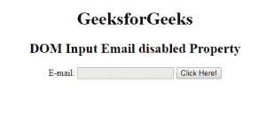
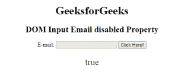
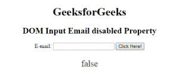

# HTML | DOM 输入电子邮件禁用属性

> 原文:[https://www . geesforgeks . org/html-DOM-input-email-disabled-property/](https://www.geeksforgeeks.org/html-dom-input-email-disabled-property/)

HTML DOM 中的**输入邮件禁用属性**用于设置或返回输入邮件字段是否必须禁用。禁用的复选框不可勾选且不可用。它是一个布尔属性，用于反映 HTML 禁用属性。
**语法:**

*   它用于返回禁用的属性。

```html
emailObject.disabled
```

*   它用于设置禁用属性。

```html
emailObject.disabled = true|false
```

**属性值:**包含以下两个属性值:

*   **真:**定义输入电子邮件字段被禁用。
*   **False:** 有默认值。它定义输入电子邮件字段未被禁用。

**返回值:**返回一个布尔值，表示输入电子邮件字段是否被禁用。
**示例 1:** 本示例返回输入电子邮件禁用属性。

## 超文本标记语言

```html
<!DOCTYPE html>
<html>

<head>
    <title>
        HTML DOM Input Email disabled Property
    </title>
</head>    

<body style="text-align:center;">

    <h1> GeeksforGeeks</h1>

    <h2>DOM Input Email disabled Property</h2>

    E-mail: <input type="email" id="email" disabled>

    <button onclick="myGeeks()">
        Click Here!
    </button>

    <p id="GFG" style="font-size:25px;color:green;"></p>

    <!-- Script to access input element with
            type email attribute -->
    <script>
        function myGeeks() {
            var em = document.getElementById("email").disabled;
            document.getElementById("GFG").innerHTML = em;
        }
    </script>
</body>

</html>                   
```

**输出:**
**点击按钮前:**



**点击按钮后:**



**示例 2:** 本示例设置输入电子邮件禁用属性。

## 超文本标记语言

```html
<!DOCTYPE html>
<html>

<head>
    <title>
        HTML DOM Input Email disabled Property
    </title>
</head>    

<body style="text-align:center;">

    <h1> GeeksforGeeks</h1>

    <h2>DOM Input Email disabled Property</h2>

    E-mail: <input type="email" id="email" disabled>

    <button onclick="myGeeks()">
        Click Here!
    </button>

    <p id="GFG" style="font-size:25px;color:green;"></p>

    <!-- Script to access input element with
            type email attribute -->
    <script>
        function myGeeks() {
            var em = document.getElementById("email").disabled =false;
            document.getElementById("GFG").innerHTML = em;
        }
    </script>
</body>

</html>                   
```

**输出:**
**点击按钮前:**


**点击按钮后:**



**支持的浏览器:**T2 DOM 输入邮件禁用属性支持的浏览器如下:

*   谷歌 Chrome
*   微软公司出品的 web 浏览器
*   火狐浏览器
*   歌剧
*   旅行队