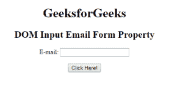
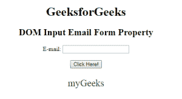

# HTML | DOM 输入电子邮件表单属性

> 原文:[https://www . geesforgeks . org/html-DOM-input-email-form-property/](https://www.geeksforgeeks.org/html-dom-input-email-form-property/)

HTML DOM 中的**输入邮件表单属性**用于返回包含输入邮件字段的表单的引用。它是只读属性，在成功时返回表单对象。
**语法:**

```html
emailObject.form 
```

**返回值:**它返回一个字符串值，该值指定包含输入电子邮件字段的表单的引用

**示例:**下面的程序说明了输入电子邮件表单属性。

## 超文本标记语言

```html
<!DOCTYPE html>
<html>

<head>
    <title>
        HTML DOM Input Email Form Property
    </title>
</head>    

<body style="text-align:center;">

    <h1> GeeksforGeeks</h1>

    <h2>DOM Input Email Form Property</h2>

    <form id="myGeeks">
    E-mail: <input type="email" id="email">
    </form><br>

    <button onclick="myGeeks()">
        Click Here!
    </button>

    <p id="GFG" style="font-size:25px;color:green;"></p>

    <!-- Script to access input element with
            type email attribute -->
    <script>
        function myGeeks() {
            var em = document.getElementById("email").form.id;
            document.getElementById("GFG").innerHTML = em;
        }
    </script>
</body>

</html>                               
```

**输出:**
**点击按钮前:**



**点击按钮后:**



**支持的浏览器:**T2 DOM 输入邮件表单属性支持的浏览器如下:

*   谷歌 Chrome
*   微软公司出品的 web 浏览器
*   火狐浏览器
*   歌剧
*   旅行队