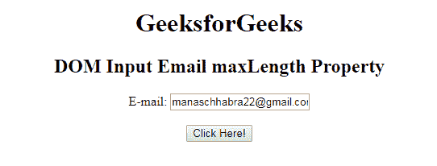
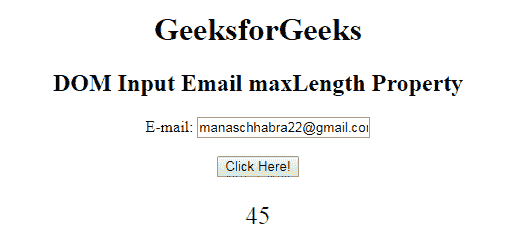
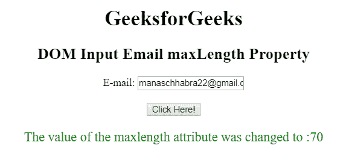

# HTML | DOM 输入邮件最大长度属性

> 原文:[https://www . geesforgeks . org/html-DOM-input-email-maxlength-property/](https://www.geeksforgeeks.org/html-dom-input-email-maxlength-property/)

HTML DOM 中的**输入邮件最大长度属性**用于设置或返回邮件输入字段的最大长度属性值。它指定了电子邮件字段中允许的最大字符数。输入电子邮件最大长度属性的默认值为 524288。

**语法:**

*   它返回输入电子邮件最大长度属性。

    ```html
    emailObject.maxLength
    ```

*   它用于设置输入电子邮件最大长度属性。

    ```html
    emailObject.maxLength = number
    ```

**属性值:**它包含单个值**数字**，用于指定电子邮件最大长度字段中允许的最大字符数。

**返回值:**它返回一个数值，代表电子邮件最大长度字段中允许的最大字符数。

**示例 1:** 此示例说明如何返回输入电子邮件最大长度属性。

```html
<!DOCTYPE html> 
<html> 

<head> 
    <title> 
        HTML DOM Input Email maxlength Property
    </title> 
</head>     

<body style="text-align:center;">

    <h1> GeeksforGeeks</h1> 

    <h2>DOM Input Email maxLength Property</h2> 

    <form id="myGeeks">
        E-mail: <input type="email" id="email" maxlength="45"
            value="manaschhabra22@gmail.com"> 
    </form><br>

    <button onclick="myGeeks()"> 
        Click Here! 
    </button> 

    <p id="GFG" style="font-size:25px;color:green;"></p> 

    <!-- Script to access input element with 
            type email attribute -->
    <script> 
        function myGeeks() { 
            var em = document.getElementById("email").maxLength;
            document.getElementById("GFG").innerHTML = em; 
        } 
    </script> 
</body> 

</html>                    
```

**输出:**
**点击按钮前:**

**点击按钮后:**


**示例 2:** 本示例说明如何设置输入电子邮件最大长度属性。

```html
<!DOCTYPE html> 
<html> 

<head> 
    <title> 
        HTML DOM Input Email maxlength Property
    </title> 
</head>     

<body style="text-align:center;">

    <h1> GeeksforGeeks</h1> 

    <h2>DOM Input Email maxLength Property</h2> 

    <form id="myGeeks">
        E-mail: <input type="email" id="email" maxlength="45"
            value="manaschhabra22@gmail.com"> 
    </form><br>

    <button onclick="myGeeks()"> 
        Click Here! 
    </button> 

    <p id="GFG" style="font-size:20px;color:green;"></p> 

    <!-- Script to set Input Email maxlength Property -->
    <script> 
        function myGeeks() { 
            var em = document.getElementById("email").maxLength
                    = "70";                         
            document.getElementById("GFG").innerHTML
                    = "The value of the maxlength attribute"
                      + " was changed to :" + em; 
        } 
    </script> 
</body> 

</html>                                 
```

**输出:**
**点击按钮前:**

**点击按钮后:**


**支持的浏览器:**T2 DOM 输入邮件最大长度属性支持的浏览器如下:

*   谷歌 Chrome
*   微软公司出品的 web 浏览器
*   火狐浏览器
*   歌剧
*   旅行队