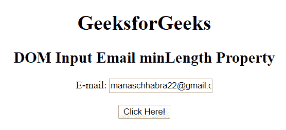
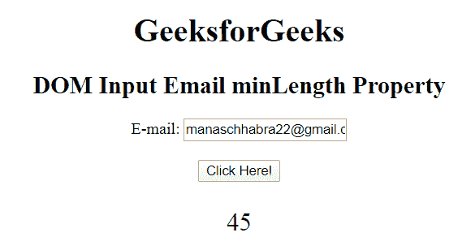
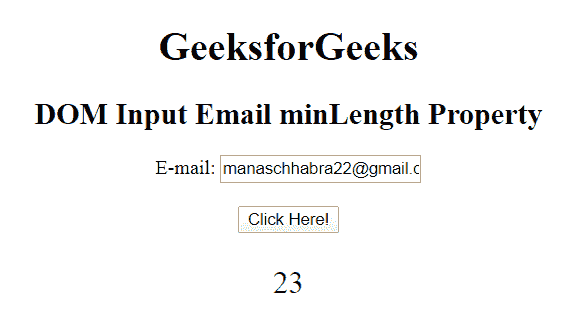

# HTML | DOM 输入邮件最小长度属性

> 原文:[https://www . geesforgeks . org/html-DOM-input-email-min length-property/](https://www.geeksforgeeks.org/html-dom-input-email-minlength-property/)

HTML DOM 中的**输入电子邮件最小长度属性**用于设置或返回电子邮件输入字段的最小长度属性值。它指定了电子邮件字段中允许的最小字符数。

**语法:**

*   它返回输入电子邮件最小长度属性。

    ```html
    emailObject.minLength
    ```

*   它用于设置输入电子邮件最小长度属性。

    ```html
    emailObject.minLength = number
    ```

**属性值:**它包含单个值**数字**，用于指定电子邮件最大长度字段中允许的最小字符数。**返回值:**返回一个数字值，代表电子邮件最小长度字段中允许的最小字符数。
**示例 1:** 此示例说明如何返回输入电子邮件最小长度属性。

```html
<!DOCTYPE html> 
<html> 

<head> 
    <title> 
        HTML DOM Input Email minlength Property 
    </title> 
</head>     

<body style="text-align:center;"> 

    <h1> GeeksforGeeks</h1> 

    <h2>DOM Input Email minLength Property</h2> 

    <form id="myGeeks"> 
        E-mail: <input type="email" id="email" minlength="45"
            value="manaschhabra22@gmail.com"> 
    </form><br> 

    <button onclick="myGeeks()"> 
        Click Here! 
    </button> 

    <p id="GFG" style="font-size:25px;color:green;"></p> 

    <!-- Script to access input element with 
            type email attribute -->
    <script> 
        function myGeeks() { 
            var em = document.getElementById("email").minLength; 
            document.getElementById("GFG").innerHTML = em; 
        } 
    </script> 
</body> 

</html>                     
```

**输出:**

*   **点击按钮前:** 
*   **点击按钮后:**
    

**示例 2:** 本示例说明如何设置输入电子邮件最小长度属性。

```html
<!DOCTYPE html> 
<html> 

<head> 
    <title> 
        HTML DOM Input Email minlength Property 
    </title> 
</head>     

<body style="text-align:center;"> 

    <h1> GeeksforGeeks</h1> 

    <h2>DOM Input Email minLength Property</h2> 

    <form id="myGeeks"> 
        E-mail: <input type="email" id="email" minlength="45"
            value="manaschhabra22@gmail.com"> 
    </form><br> 

    <button onclick="myGeeks()"> 
        Click Here! 
    </button> 

    <p id="GFG" style="font-size:25px;color:green;"></p> 

    <!-- Script to access input element with 
            type email attribute -->
    <script> 
        function myGeeks() { 
            var em =
      document.getElementById("email").minLength="23"; 
            document.getElementById("GFG").innerHTML = em; 
        } 
    </script> 
</body> 

</html>                     
```

**输出:**

*   **点击按钮前:**


*   **点击按钮后:**



**支持的浏览器:****HTML DOM 输入邮件最小长度属性**支持的浏览器如下:

*   谷歌 Chrome
*   微软公司出品的 web 浏览器
*   火狐浏览器
*   苹果 Safari
*   歌剧