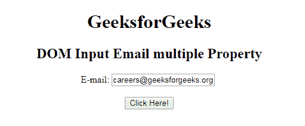
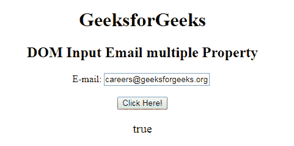
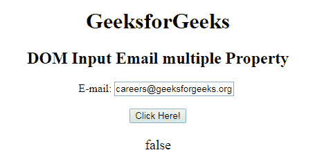

# HTML | DOM 输入邮件多属性

> 原文:[https://www . geesforgeks . org/html-DOM-input-email-multi-property/](https://www.geeksforgeeks.org/html-dom-input-email-multiple-property/)

HTML DOM 中的 **Input Email multiple 属性**用于设置或返回是否允许用户输入一个元素中出现的多个值。它是一个布尔属性，返回电子邮件字段是否接受多个电子邮件值。它用来反映 HTML 的多重属性。提交表单时，电子邮件用逗号分隔。例如:abc@gfg.com、carrers@gfg.com、manas@gfg.com 等。

**语法:**

*   它返回输入电子邮件多重属性。

    ```html
    emailObject.multiple
    ```

*   它用于设置输入电子邮件多重属性。

    ```html
    emailObject.multiple = true|false
    ```

**属性值:**包含以下两个值:

*   **true:** 接受多个值。
*   **false:** 为默认值。它不接受多封邮件。

**示例 1:** 此示例说明如何返回输入电子邮件多个属性。

```html
<!DOCTYPE html> 
<html> 

<head> 
    <title> 
        HTML DOM Input Email multiple Property 
    </title> 
</head>     

<body style="text-align:center;"> 

    <h1> GeeksforGeeks</h1> 

    <h2>DOM Input Email multiple Property</h2> 

    E-mail: <input type="email" id="email"
            value="careers@geeksforgeeks.org" multiple>

    <br><br>

    <button onclick="myGeeks()"> 
        Click Here! 
    </button> 

    <p id="GFG" style="font-size:20px;color:green;"></p> 

    <!-- Script to use Input Email multiple Property -->
    <script> 
        function myGeeks() { 
            var em = document.getElementById("email").multiple; 
            document.getElementById("GFG").innerHTML = em; 
        } 
    </script> 
</body> 

</html>                    
```

**输出:**
**点击按钮前:**

**点击按钮后:**


**示例 2:** 本示例说明如何设置输入电子邮件多个属性。

```html
<!DOCTYPE html> 
<html> 

<head> 
    <title> 
        HTML DOM Input Email multiple Property 
    </title> 
</head>     

<body style="text-align:center;"> 

    <h1> GeeksforGeeks</h1> 

    <h2>DOM Input Email multiple Property</h2> 

    E-mail: <input type="email" id="email"
            value="careers@geeksforgeeks.org" multiple>

    <br><br>

    <button onclick="myGeeks()"> 
        Click Here! 
    </button> 

    <p id="GFG" style="font-size:20px;color:green;"></p> 

    <!-- Script to use Input Email multiple Property -->
    <script> 
        function myGeeks() { 
            var em = document.getElementById("email").multiple
                    = "false"; 
            document.getElementById("GFG").innerHTML = em; 
        } 
    </script> 
</body> 

</html>                    
```

**输出:**
**点击按钮前:**

**点击按钮后:**


**支持的浏览器:**T2 DOM 输入邮件多属性支持的浏览器如下:

*   谷歌 Chrome
*   Internet Explorer 10.0
*   火狐浏览器
*   歌剧
*   旅行队