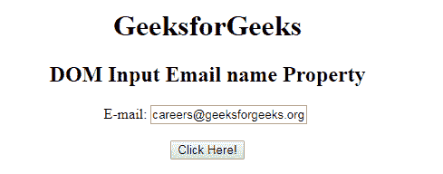
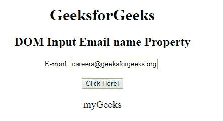
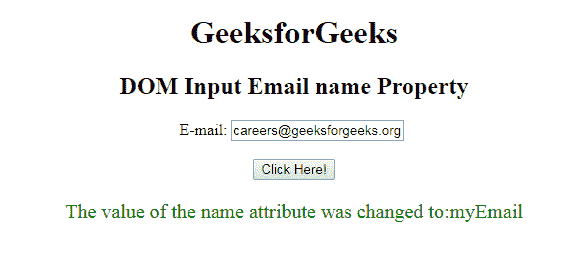

# HTML | DOM 输入邮件名称属性

> 原文:[https://www . geesforgeks . org/html-DOM-input-email-name-property/](https://www.geeksforgeeks.org/html-dom-input-email-name-property/)

HTML DOM 中的**输入邮件名称属性**用于设置或返回邮件字段的名称属性值。每个输入字段都需要名称属性。如果没有在输入字段中指定 name 属性，则根本不会发送该字段的数据。

**语法:**

*   它返回输入电子邮件名称属性。

    ```html
    emailObject.name
    ```

*   它用于设置输入电子邮件名称属性。

    ```html
    emailObject.name = name
    ```

**属性值:**它包含单个值**名称**，该名称定义了电子邮件字段的名称。

**返回值:**返回一个代表电子邮件字段名称的字符串值。

**示例 1:** 本示例说明如何返回输入电子邮件名称属性。

```html
<!DOCTYPE html> 
<html> 

<head> 
    <title> 
        HTML DOM Input Email name Property 
    </title> 
</head>     

<body style="text-align:center;"> 

    <h1> GeeksforGeeks</h1> 

    <h2>DOM Input Email name Property</h2> 

    E-mail: <input type="email" id="email" name="myGeeks"
            value="careers@geeksforgeeks.org" multiple> 

    <br><br>

    <button onclick="myGeeks()"> 
        Click Here! 
    </button> 

    <p id="GFG" style="font-size:20px;color:green;"></p> 

    <!-- Script to use Input Email name Property -->
    <script> 
        function myGeeks() { 
            var em = document.getElementById("email").name; 
            document.getElementById("GFG").innerHTML = em; 
        } 
    </script> 
</body> 

</html>                        
```

**输出:**
**点击按钮前:**

**点击按钮后:**


**示例 2:** 本示例说明如何设置输入电子邮件名称属性。

```html
<!DOCTYPE html> 
<html> 

<head> 
    <title> 
        HTML DOM Input Email name Property 
    </title> 
</head>     

<body style="text-align:center;"> 

    <h1> GeeksforGeeks</h1> 

    <h2>DOM Input Email name Property</h2> 

    E-mail: <input type="email" id="email" name="myGeeks"
            value="careers@geeksforgeeks.org" multiple> 

    <br><br>

    <button onclick="myGeeks()"> 
        Click Here! 
    </button> 

    <p id="GFG" style="font-size:20px;color:green;"></p> 

    <!-- Script to set Input Email name Property -->
    <script> 
        function myGeeks() { 
            var em = document.getElementById("email").name
                    = "myEmail"; 

            document.getElementById("GFG").innerHTML
                    = "The value of the name attribute"
                      + " was changed to:" + em; 
        } 
    </script> 
</body> 

</html>                                
```

**输出:**
**点击按钮前:**

**点击按钮后:**


**支持的浏览器:**T2 DOM 输入邮件名称属性支持的浏览器如下:

*   谷歌 Chrome
*   微软公司出品的 web 浏览器
*   火狐浏览器
*   歌剧
*   旅行队