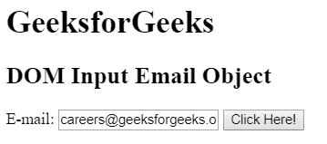
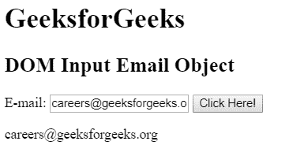
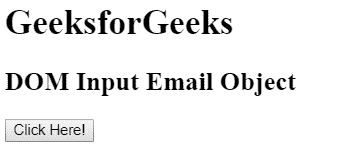
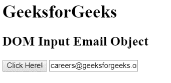

# HTML | DOM 输入邮件对象

> 原文:[https://www.geeksforgeeks.org/html-dom-input-email-object/](https://www.geeksforgeeks.org/html-dom-input-email-object/)

HTML DOM 中的**输入邮件对象**用于表示带有 *type="email"* 属性的 HTML 输入元素。使用 getElementById()方法可以访问具有 *type="email"* 属性的输入元素。

**语法:**

*   它用于访问输入电子邮件对象。

```html
document.getElementById("id");
```

*   它用于创建输入元素。

```html
document.createElement("input");
```

**输入邮件对象属性:**

<figure class="table">

| attribute | describe |
| type | This property is used to return the type of the form element to the mail field. |
| value | This property is used to set or return the value of the value property of the e-mail field. |
| Automatic completion | This property is used to set or return the value of the autocomplete property of the e-mail field. |
| auto-focusing | This property is used to set or return whether the mail field should be autofocused when the page is loaded. |
| default | This property is used to set or return the default value of the e-mail field. |
| forbidden | This property is used to set or return whether the e-mail field is disabled. |
| sheet/form | This property is used to return a reference to a form that contains an e-mail field. |
| tabulation/listing | This property is used to return a reference to a data list containing e-mail fields. |
| 最大长 | This property is used to set or return the value of the maxLength property of the e-mail field. |
| multiple | This property is used to set or return whether users are allowed to enter multiple e-mail addresses in the e-mail field. |
| name | This property is used to set or return the value of the name property of the e-mail field. |
| model | This property is used to set or return the value of the mode property of the e-mail field. |
| placeholder | This property is used to set or return the value of the placeholder property of the e-mail field. |
| 只读的 | This property is used to set or return whether the mail field is read-only. |
| affirmatively choose | This property is used to set or return whether the mail field must be filled in before submitting the form. |
| size | This property is used to set or return the value of the size property of the mail field. |

</figure>

**例 1:** 本例使用 getElementById()方法访问<输入>元素，元素类型为 type="email "属性。

## 超文本标记语言

```html
<!DOCTYPE html>
<html>

<head>
    <title>
        HTML DOM Input Email Object
    </title>
</head>   

<body>

    <h1> GeeksforGeeks</h1>

    <h2>DOM Input Email Object</h2>

    E-mail: <input type="email" id="email"
            value="careers@geeksforgeeks.org">

    <button onclick="myGeeks()">
        Click Here!
    </button>

    <p id="GFG"></p>

    <!-- Script to access input element with
            type email attribute -->
    <script>
        function myGeeks() {
            var em = document.getElementById("email").value;
            document.getElementById("GFG").innerHTML = em;
        }
    </script>
</body>

</html>                   
```

**输出:**
**之前点击按钮:**



**点击按钮后:**



**示例 2:** 本示例使用 document.createElement()方法创建具有 type="email "属性的<输入>元素。

## 超文本标记语言

```html
<!DOCTYPE html>
<html>

<head>
    <title>
        HTML DOM Input Email Object
    </title>
</head>   

<body>

    <h1> GeeksforGeeks</h1>

    <h2>DOM Input Email Object</h2>

    <button onclick="myGeeks()">
        Click Here!
    </button>

    <!-- script to create input element of
        type email attribute -->
    <script>
        function myGeeks() {

            /* Create an input element */
            var x = document.createElement("INPUT");

            /* Set the type attribute */
            x.setAttribute("type", "email");

            /* Set the value to type attribute */
            x.setAttribute("value", " careers@geeksforgeeks.org");

            /* Append the element to body tag */
            document.body.appendChild(x);
        }
    </script>
</body>

</html>                   
```

**输出:**
**之前点击按钮:**



**点击按钮后:**



**支持的浏览器**:

*   谷歌 Chrome
*   互联网浏览器(IE 9 之后)
*   火狐浏览器
*   歌剧