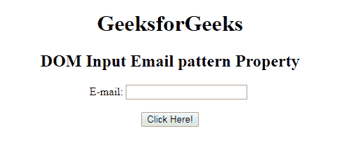
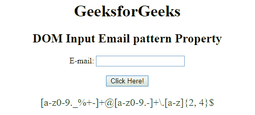

# HTML | DOM 输入邮件模式属性

> 原文:[https://www . geesforgeks . org/html-DOM-input-email-pattern-property/](https://www.geeksforgeeks.org/html-dom-input-email-pattern-property/)

HTML DOM 中的**输入邮件模式属性**用于设置或返回邮件字段的模式属性。它用于指定用于检查输入元素值的正则表达式。使用全局标题属性来描述帮助用户的模式。

**语法:**

*   它返回输入电子邮件模式属性。

    ```html
    emailObject.pattern
    ```

*   它用于设置输入电子邮件模式属性。

    ```html
    emailObject.pattern = regexp
    ```

**属性值:**它包含单个值**正则表达式**，用于指定检查电子邮件字段值所依据的正则表达式。

**返回值:**它返回一个字符串值，该值代表检查电子邮件字段值所依据的正则表达式。

**示例:**此示例说明了输入电子邮件模式属性的使用。

```html
<!DOCTYPE html> 
<html> 

<head> 
    <title> 
        HTML DOM Input Email pattern Property 
    </title> 
</head>     

<body style="text-align:center;"> 

    <h1> GeeksforGeeks</h1> 

    <h2>DOM Input Email pattern Property</h2> 

    E-mail: <input type="email" id="email" name="myGeeks"
        pattern="[a-z0-9._%+-]+@[a-z0-9.-]+\.[a-z]{2, 4}{content}quot;>

    <br><br>

    <button onclick="myGeeks()"> 
        Click Here! 
    </button> 

    <p id="GFG" style="font-size:20px;color:green;"></p> 

    <!-- Script to use Input Email pattern Property -->
    <script> 
        function myGeeks() { 
            var em = document.getElementById("email").pattern;
            document.getElementById("GFG").innerHTML = em; 
        } 
    </script> 
</body> 

</html>                    
```

**输出:**
**点击按钮前:**

**点击按钮后:**


**支持的浏览器:****DOM 输入邮件模式属性**支持的浏览器如下:

*   谷歌 Chrome
*   Internet Explorer 10.0
*   火狐浏览器
*   歌剧
*   旅行队