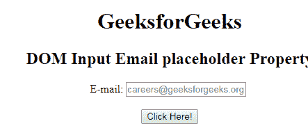
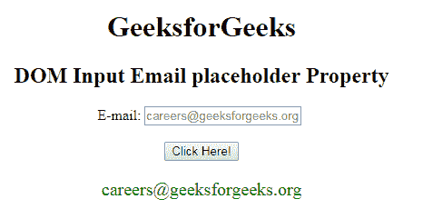

# HTML | DOM 输入电子邮件占位符属性

> 原文:[https://www . geesforgeks . org/html-DOM-input-email-placeholder-property/](https://www.geeksforgeeks.org/html-dom-input-email-placeholder-property/)

**DOM 输入电子邮件占位符属性**用于设置或返回电子邮件字段的**占位符属性**的值。占位符属性指定一个简短的提示，描述输入字段/文本区域的预期值。在用户输入值之前，短提示会显示在字段中。

**语法:**

*   它用于返回占位符属性。

    ```html
    emailObject.placeholder
    ```

*   它用于设置占位符属性。

    ```html
    emailObject.placeholder = text
    ```

**属性值:**

*   **文本:**它定义了一个简短的提示，描述了电子邮件字段的预期值。

**返回值:**它返回一个字符串值，该值代表描述电子邮件字段预期值的简短提示。

**示例-1:** 这个示例说明了如何**返回**属性。

```html
<!DOCTYPE html> 
<html> 

<head> 
    <title> 
        HTML DOM Input Email placeholder Property 
    </title> 
</head>     

<body STYLE="TEXT-ALIGN:CENTER;"> 

    <h1> GeeksforGeeks</h1> 

    <h2>DOM Input Email placeholder Property</h2> 

    E-mail: <input type="email" id="email" name="myGeeks"
         placeholder="careers@geeksforgeeks.org"> <BR><br>

    <button onclick="myGeeks()"> 
        Click Here! 
    </button> 

    <p id="GFG" style="font-size:20px;color:green;"></p> 

    <!-- Script to access input element with 
            type email attribute -->
    <script> 
        function myGeeks() { 
        <!--return the placeholder Property -->
            var em = document.getElementById("email").placeholder;
            document.getElementById("GFG").innerHTML = em; 
        } 
    </script> 
</body> 

</html>                     
```

**输出:**
**点击按钮前:**

**点击按钮后:**


**示例-2 :** 本示例说明如何**设置**属性。

```html
<!DOCTYPE html> 
<html> 

<head> 
    <title> 
        HTML DOM Input Email placeholder Property 
    </title> 
</head>     

<body STYLE="TEXT-ALIGN:CENTER;"> 

    <h1> GeeksforGeeks</h1> 

    <h2>DOM Input Email placeholder Property</h2> 

    E-mail: <input type="email" id="email" name="myGeeks"
         placeholder="careers@geeksforgeeks.org"> <BR><br>

    <button onclick="myGeeks()"> 
        Click Here! 
    </button> 

    <p id="GFG" style="font-size:20px;color:green;"></p> 

    <!-- Script to access input element with 
            type email attribute -->
    <script> 
        function myGeeks() { 
        <!--setting the multiple Property -->
            var em = document.getElementById("email").placeholder =
                                           "Input Your Email Address";
            document.getElementById("GFG").innerHTML 
              = "The value of the placeholder attribute was changed to :" 
                 + em; 
        } 
    </script> 
</body> 

</html>                     
```

**输出:**
**点击按钮前:**

**点击按钮后:**


**支持的浏览器:**T2 DOM 输入邮件占位符属性支持的浏览器如下:

*   谷歌 Chrome
*   微软公司出品的 web 浏览器
*   火狐浏览器
*   歌剧
*   旅行队