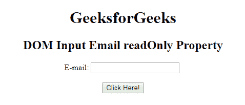
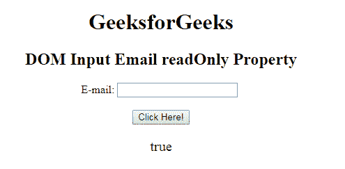
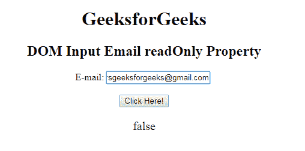

# HTML | DOM 输入电子邮件只读属性

> 原文:[https://www . geesforgeks . org/html-DOM-input-email-readonly-property/](https://www.geeksforgeeks.org/html-dom-input-email-readonly-property/)

**DOM 输入电子邮件只读属性**用于设置或返回电子邮件字段是否应为只读。这意味着用户不能修改或更改特定元素中已经存在的内容(但是，用户可以定位到它，突出显示它，并从中复制文本)，而 JavaScript 可以用于更改只读值并使输入字段可编辑。

**语法:**

*   它用于返回 readOnly 属性。

    ```html
    emailObject.readOnly
    ```

*   它用于设置 readOnly 属性。

    ```html
    emailObject.readOnly = true|false
    ```

**属性值:**

*   **true:** 定义邮件字段为只读。
*   **false:** 为默认值。它定义电子邮件字段不是只读的。

**返回值:**返回一个布尔值，表示电子邮件字段是否为只读。

**示例-1:** 这个示例说明了如何返回属性。

```html
<!DOCTYPE html> 
<html> 

<head> 
    <title> 
        HTML DOM Input Email readOnly Property 
    </title> 
</head>     

<body STYLE="TEXT-ALIGN:CENTER;"> 

    <h1> GeeksforGeeks</h1> 

    <h2>DOM Input Email readOnly Property</h2> 

    E-mail: <input type="email" id="email" name="myGeeks"
          readonly> <BR><br>

    <button onclick="myGeeks()"> 
        Click Here! 
    </button> 

    <p id="GFG" style="font-size:20px;color:green;"></p> 

    <!-- Script to access input element with 
            type email attribute -->
    <script> 
        function myGeeks() { 
        <!--returning the readonly Property -->
            var em = document.getElementById("email").readOnly;
            document.getElementById("GFG").innerHTML =  em; 
        } 
    </script> 
</body> 

</html>                     
```

**输出:**
**点击按钮前:**

**点击按钮后:**

**示例-2 :** 本示例说明如何设置属性。

```html
<!DOCTYPE html> 
<html> 

<head> 
    <title> 
        HTML DOM Input Email readOnly Property 
    </title> 
</head>     

<body STYLE="TEXT-ALIGN:CENTER;"> 

    <h1> GeeksforGeeks</h1> 

    <h2>DOM Input Email readOnly Property</h2> 

    E-mail: <input type="email" id="email" name="myGeeks"
          readonly> <BR><br>

    <button onclick="myGeeks()"> 
        Click Here! 
    </button> 

    <p id="GFG" style="font-size:20px;color:green;"></p> 

    <!-- Script to access input element with 
            type email attribute -->
    <script> 
        function myGeeks() { 
        <!--returning the readonly Property -->
            var em = document.getElementById("email").readOnly =false;
            document.getElementById("GFG").innerHTML =  em; 
        } 
    </script> 
</body> 

</html>                     
```

**输出:**
**点击按钮前:**

**点击按钮后:**


**支持的浏览器:**T2 DOM 输入邮件只读属性支持的浏览器如下:

*   谷歌 Chrome
*   微软公司出品的 web 浏览器
*   火狐浏览器
*   歌剧
*   旅行队