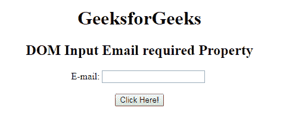
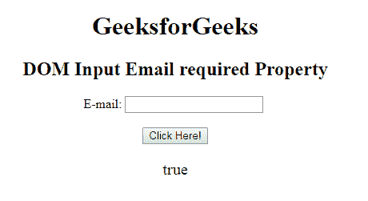
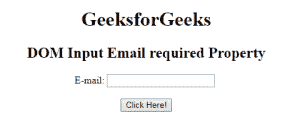
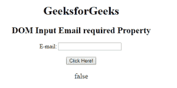

# HTML | DOM 输入电子邮件所需属性

> 原文:[https://www . geesforgeks . org/html-DOM-input-email-required-property/](https://www.geeksforgeeks.org/html-dom-input-email-required-property/)

HTML DOM 中的**输入邮件必填属性**用于设置或返回提交表单时是否需要填写输入邮件字段。此属性用于反映 HTML 必需的属性。

**语法:**

*   它返回输入电子邮件必需属性。

    ```html
    emailObject.required
    ```

*   它用于设置需要输入电子邮件的属性。

    ```html
    emailObject.required = true|false
    ```

**属性值:**

*   **true:** 指定提交表单前必须填写电子邮件字段。
*   **false:** 为默认值。它规定在提交表单之前不得填写电子邮件字段。

**返回值:**返回一个布尔值，代表提交表单前是否必须填写电子邮件字段。

**示例 1:** 本示例说明如何返回 Input Email 必需属性。

```html
<!DOCTYPE html> 
<html> 

<head> 
    <title> 
        HTML DOM Input Email required Property 
    </title> 
</head>     

<body style="text-align:center;"> 

    <h1>GeeksforGeeks</h1> 

    <h2>
        DOM Input Email required Property
    </h2> 

    E-mail: <input type="email" id="email" 
            name="myGeeks" required> 

    <br><br>

    <button onclick="myGeeks()"> 
        Click Here! 
    </button> 

    <p id="GFG" style="font-size:20px;color:green;"></p> 

    <!-- Script to use Input Email required Property -->
    <script> 
        function myGeeks() { 
            var em = document.getElementById("email").required;
            document.getElementById("GFG").innerHTML = em; 
        } 
    </script> 
</body> 

</html>                    
```

**输出:**
**点击按钮前:**

**点击按钮后:**


**示例 2:** 本示例说明如何设置输入电子邮件必需属性。

```html
<!DOCTYPE html> 
<html> 

<head> 
    <title> 
        HTML DOM Input Email required Property 
    </title> 
</head>     

<body style="text-align:center;"> 

    <h1>GeeksforGeeks</h1> 

    <h2>
        DOM Input Email required Property
    </h2> 

    E-mail: <input type="email" id="email" 
            name="myGeeks" required> 

    <br><br>

    <button onclick="myGeeks()"> 
        Click Here! 
    </button> 

    <p id="GFG" style="font-size:20px;color:green;"></p> 

    <!-- Script to set Input Email required Property -->
    <script> 
        function myGeeks() { 
            var em = document.getElementById("email").required
                    = false;

            document.getElementById("GFG").innerHTML = em; 
        } 
    </script> 
</body> 

</html>                    
```

**输出:**
**点击按钮前:**

**点击按钮后:**


**支持的浏览器:****DOM 输入邮件所需属性**支持的浏览器如下:

*   谷歌 Chrome
*   Internet Explorer 10.0
*   火狐浏览器
*   歌剧
*   旅行队