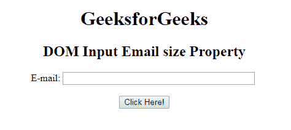
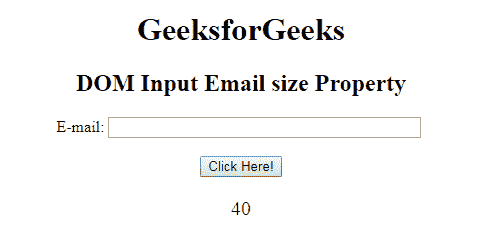
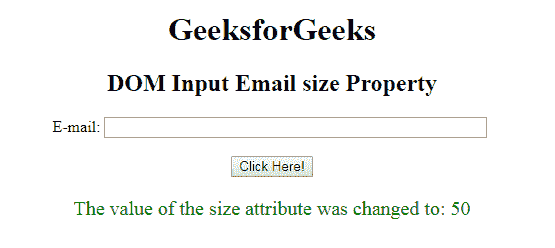

# HTML | DOM 输入邮件大小属性

> 原文:[https://www . geesforgeks . org/html-DOM-input-email-size-property/](https://www.geeksforgeeks.org/html-dom-input-email-size-property/)

HTML DOM 中的**输入邮件大小属性**用于设置或返回输入邮件字段的大小属性值。大小属性用于定义电子邮件字段的宽度。它的默认值是 20。

**语法:**

*   它返回输入电子邮件大小属性。

    ```html
    emailObject.size
    ```

*   它用于设置输入电子邮件大小属性。

    ```html
    emailObject.size = number
    ```

**属性值:**它包含单个值**数字**，用于根据字符数指定电子邮件字段的宽度。

**返回值:**返回代表电子邮件字段宽度的数值，以字符数表示。

**示例 1:** 此示例说明如何返回输入电子邮件大小属性。

```html
<!DOCTYPE html> 
<html> 

<head> 
    <title> 
        HTML DOM Input Email size Property 
    </title> 
</head>     

<body style="text-align:center;"> 

    <h1>GeeksforGeeks</h1> 

    <h2>
        DOM Input Email size Property
    </h2> 

    E-mail: <input type="email" id="email"
            name="myGeeks" size="40">

    <br><br>

    <button onclick="myGeeks()"> 
        Click Here! 
    </button> 

    <p id="GFG" style="font-size:20px;color:green;"></p> 

    <!-- Script to return Input Email size Property -->
    <script> 
        function myGeeks() { 
            var em = document.getElementById("email").size;
            document.getElementById("GFG").innerHTML = em; 
        } 
    </script> 
</body> 

</html>                    
```

**输出:**
**点击按钮前:**

**点击按钮后:**


**示例 2:** 本示例说明如何设置输入电子邮件大小属性。

```html
<!DOCTYPE html> 
<html> 

<head> 
    <title> 
        HTML DOM Input Email size Property 
    </title> 
</head>     

<body style="text-align:center;"> 

    <h1>GeeksforGeeks</h1> 

    <h2>
        DOM Input Email size Property
    </h2> 

    E-mail: <input type="email" id="email"
            name="myGeeks" size="40">

    <br><br>

    <button onclick="myGeeks()"> 
        Click Here! 
    </button> 

    <p id="GFG" style="font-size:20px;color:green;"></p> 

    <!-- Script to set Input Email size Property -->
    <script> 
        function myGeeks() { 
            var em = document.getElementById("email").size
                    ="50";

            document.getElementById("GFG").innerHTML 
                    = "The value of the size attribute "
                      + "was changed to: " + em; 
        } 
    </script> 
</body> 

</html>                    
```

**输出:**
**点击按钮前:**

**点击按钮后:**


**支持的浏览器:**T2 DOM 输入邮件大小属性支持的浏览器如下:

*   谷歌 Chrome
*   Internet Explorer 10.0
*   火狐浏览器
*   歌剧
*   旅行队