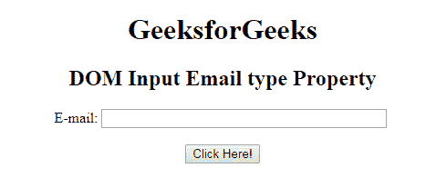
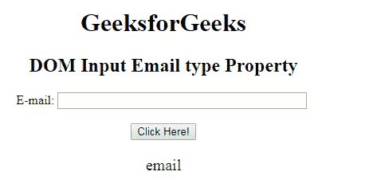

# HTML | DOM 输入邮件类型属性

> 原文:[https://www . geesforgeks . org/html-DOM-input-email-type-property/](https://www.geeksforgeeks.org/html-dom-input-email-type-property/)

HTML DOM 中的**输入邮件类型属性**用于返回邮件字段的表单元素类型。它总是为输入电子邮件字段返回一封电子邮件。

**语法:**

```html
emailObject.type
```

**返回值:**返回一个字符串值，代表电子邮件字段的表单元素类型。

下面的程序说明了 HTML DOM 中的电子邮件类型属性:

**示例:**本示例返回电子邮件字段的表单元素类型。

## 超文本标记语言

```html
<!DOCTYPE html>
<html>

<head>
    <title>
        HTML DOM Input Email type Property
    </title>
</head>    

<body style="text-align:center;">

    <h1>GeeksforGeeks</h1>

    <h2>
        DOM Input Email type Property
    </h2>

    E-mail: <input type="email" id="email"
            name="myGeeks" size="40">

    <br><br>

    <button onclick="myGeeks()">
        Click Here!
    </button>

    <p id="GFG" style="font-size:20px;color:green;"></p>

    <!-- Script to return Input Email type Property -->
    <script>
        function myGeeks() {
            var em = document.getElementById("email").type;
            document.getElementById("GFG").innerHTML = em;
        }
    </script>
</body>

</html>                   
```

**输出:**
**点击按钮前:**



**点击按钮后:**



**支持的浏览器:**T2 DOM 输入邮件类型属性支持的浏览器如下:

*   谷歌 Chrome
*   Internet Explorer 10.0
*   火狐浏览器
*   歌剧
*   旅行队