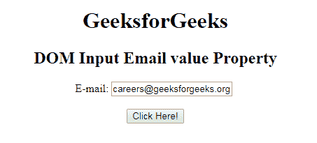
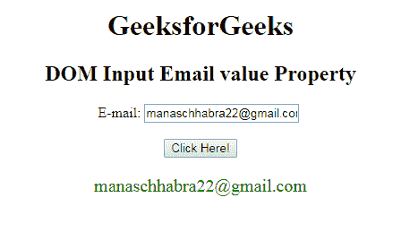

# HTML | DOM 输入邮件值属性

> 原文:[https://www . geesforgeks . org/html-DOM-input-email-value-property/](https://www.geeksforgeeks.org/html-dom-input-email-value-property/)

HTML DOM 中的**输入电子邮件值属性**用于设置或返回电子邮件字段的值属性的值。值属性指定输入电子邮件字段的初始值。该值可以是单个地址或地址列表。

**语法:**

*   它返回输入电子邮件值属性。

    ```html
    emailObject.value
    ```

*   它用于设置输入电子邮件值属性。

    ```html
    emailObject.value = text
    ```

**属性值:**包含单值**文本**，定义单个电子邮件地址或电子邮件地址列表。

**返回值:**返回代表用户有效电子邮件地址的字符串值。

**示例 1:** 本示例说明如何返回 Input Email 值属性。

```html
<!DOCTYPE html> 
<html> 

<head> 
    <title> 
        HTML DOM Input Email value Property 
    </title> 
</head>     

<body style="text-align:center;"> 

    <h1>GeeksforGeeks</h1> 

    <h2>DOM Input Email value Property</h2> 

    E-mail: <input type="email" id="email" name="myGeeks"
            value="careers@geeksforgeeks.org"> 

    <br><br>

    <button onclick="myGeeks()"> 
        Click Here! 
    </button> 

    <p id="GFG" style="font-size:20px;color:green;"></p> 

    <!-- Script to return Input Email value Property -->
    <script> 
        function myGeeks() { 
            var em = document.getElementById("email").value;
            document.getElementById("GFG").innerHTML = em; 
        } 
    </script> 
</body> 

</html>                    
```

**输出:**
**点击按钮前:**

**点击按钮后:**


**示例 2:** 本示例说明如何设置输入电子邮件值属性。

```html
<!DOCTYPE html> 
<html> 

<head> 
    <title> 
        HTML DOM Input Email value Property 
    </title> 
</head>     

<body style="text-align:center;"> 

    <h1>GeeksforGeeks</h1> 

    <h2>DOM Input Email value Property</h2> 

    E-mail: <input type="email" id="email" name="myGeeks"
        value="careers@geeksforgeeks.org"> 

    <br><br>

    <button onclick="myGeeks()"> 
        Click Here! 
    </button> 

    <p id="GFG" style="font-size:20px;color:green;"></p> 

    <!-- Script to set Input Email value Property -->
    <script> 
        function myGeeks() { 
            var em = document.getElementById("email").value
                    ="manaschhabra22@gmail.com";

            document.getElementById("GFG").innerHTML = em; 
        } 
    </script> 
</body> 

</html>                         
```

**输出:**
**点击按钮前:**

**点击按钮后:**


**支持的浏览器:**T2 DOM 输入邮件值属性支持的浏览器如下:

*   谷歌 Chrome
*   Internet Explorer 10.0
*   火狐浏览器
*   歌剧
*   旅行队