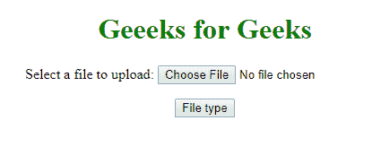
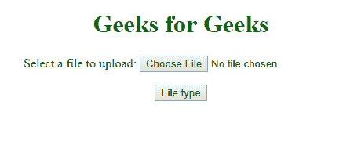
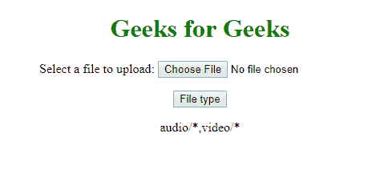

# HTML | DOM 输入文件上传接受属性

> 原文:[https://www . geesforgeks . org/html-DOM-input-file upload-accept-property/](https://www.geeksforgeeks.org/html-dom-input-fileupload-accept-property/)

HTML DOM 中的 **DOM 输入文件上传接受属性**用于**设置**或**返回** *文件上传按钮*的接受属性值。accept 属性指定服务器可接受的文件类型。

**语法:**

*   **返还接受财产:**

    ```html
    fileuploadObject.accept
    ```

*   **设置接受属性:**

    ```html
    fileuploadObject.accept="audio/*, video/*, image/*, MIME_type"
    ```

**属性值:**

*   **音频/* :** 所有声音文件均可接受
*   **视频/* :** 所有视频文件均可
*   **图像/* :** 所有图像文件均可接受
*   **MIME_type :** 有效的 MIME 类型，没有参数。

**返回值:**返回代表接受文件类型的字符串值。

**示例-1:** 返回**接受的**文件类型。

```html
<!DOCTYPE html>
<html>

<head>
    <style>
        h1 {
            color: green;
        }
    </style>

</head>

<body>
    <center>
        <h1>
          Geeeks for Geeks
      </h1>
        <p>Select a file to upload:
            <input type="file" 
                   id="myFile" 
                   size="50"
                   accept="video/*">
        </p>
        <button onclick="myFunction()">
            File type
        </button>

        <p id="demo"></p>

        <script>
            function myFunction() {

                var gfg =
                    document.getElementById(
                      "myFile").accept;

                document.getElementById(
                  "demo").innerHTML = gfg;
            }
        </script>
    </center>
</body>

</html>
```

**输出:**
**点击前:**


**点击后:**


**示例:**设置**接受的**文件类型。

```html
<!DOCTYPE html>
<html>

<head>
    <style>
        h1 {
            color: green;
        }
    </style>

</head>

<body>
    <center>
        <h1>
          Geeks for Geeks
      </h1>
      <p>Select a file to upload:
            <input type="file" 
                   id="myFile" 
                   size="50"
                   accept="video/*">
        </p>

        <button onclick="myFunction()">
          File type
      </button>

        <p id="demo"></p>

        <script>
            function myFunction() {

                var gfg = 
                    document.getElementById(
                      "myFile").accept = 
                    "audio/*,video/*";

                document.getElementById(
                  "demo").innerHTML = gfg;
            }
        </script>

    </center>
</body>

</html>
```

**输出:**
**点击前:**


**点击后:**


**支持的浏览器:**

*   谷歌 Chrome
*   Mozilla Firefox
*   边缘
*   歌剧
*   旅行队