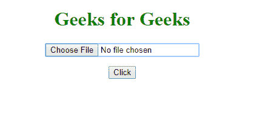
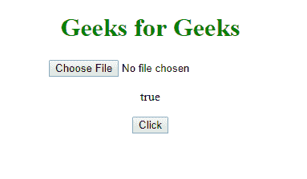
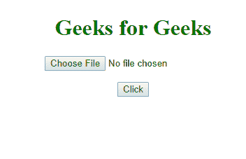
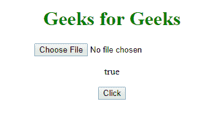

# HTML | DOM 输入文件上传自动对焦属性

> 原文:[https://www . geesforgeks . org/html-DOM-input-file upload-autofocus-property/](https://www.geeksforgeeks.org/html-dom-input-fileupload-autofocus-property/)

HTML DOM 中的**输入文件上传自动对焦属性**用于**设置**或**返回**页面加载时*文件上传按钮是否自动对焦*。

**语法:**

*   **返回自动对焦属性:**

    ```html
    fileuploadObject.autofocus
    ```

*   **设置自动对焦属性:**

    ```html
    fileuploadObject.autofocus=true|false
    ```

**属性值:**

*   **真:**文件上传按钮聚焦
*   **假:**文件上传按钮没有聚焦

**返回值:**

*   它返回一个布尔值，该值代表上传按钮的焦点或时间。

**示例-1:** 返回自动对焦属性。

```html
<!DOCTYPE html>
<html>

<head>
    <style>
        h1 {
            color: green;
        }
    </style>
</head>

<body>
    <center>
        <h1>Geeks for Geeks</h1>
        <input type="file"
               id="myFile"
               autofocus>

        <p id="demo">
      </p>

        <button onclick="myFunction()">
          Click
      </button>

        <script>
            function myFunction() {
                var x = 
                    document.getElementById(
                      "myFile").autofocus;

                document.getElementById(
                  "demo").innerHTML = x;
            }
        </script>
    </center>
</body>

</html>
```

**输出:**
**点击前:**

**点击后:**


**示例-2:** 设置自动对焦属性。

```html
<!DOCTYPE html>
<html>

<head>
    <style>
        h1 {
            color: green;
        }
    </style>
</head>

<body>
    <center>
        <h1>
          Geeks for Geeks
      </h1>
        <input type="file"
               id="myFile">

        <p id="demo">
      </p>

        <button onclick="myFunction()">
          Click
      </button>

        <script>
            function myFunction() {
                var x = 
                    document.getElementById(
                      "myFile").autofocus = 
                    "true";

                document.getElementById(
                  "demo").innerHTML = x;
            }
        </script>
  </center>

</body>

</html>
```

**输出:**
**点击前:**

**点击后:**


**支持的浏览器:**

*   谷歌 Chrome
*   Mozilla Firefox
*   边缘
*   歌剧
*   旅行队