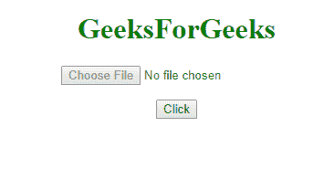
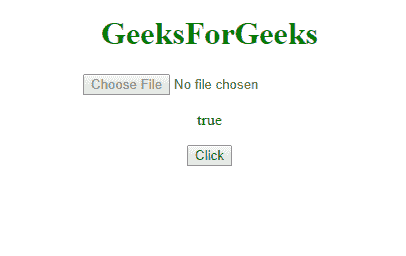
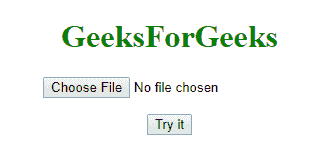
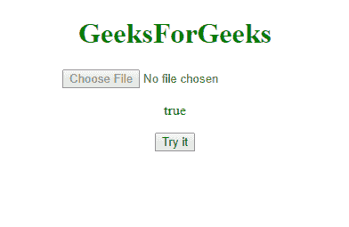

# HTML | DOM 输入文件上传禁用属性

> 原文:[https://www . geesforgeks . org/html-DOM-input-file upload-disabled-property/](https://www.geeksforgeeks.org/html-dom-input-fileupload-disabled-property/)

HTML DOM 中用于**设置**或**的**输入文件上传禁用属性**返回**是否必须禁用*文件上传字段。
禁用字段不可用且不可点击。它是一个布尔属性，用于反映 HTML 禁用属性。在所有浏览器中，默认情况下，它通常呈现为灰色。*

**语法:**

*   **返还禁用属性:**

    ```html
    fileuploadObject.disabled
    ```

*   **设置禁用属性:**

    ```html
    fileuploadObject.disabled=true|false
    ```

**属性值:**

*   **真:**定义文件上传字段被禁用
*   **false:** 有默认值。它定义文件上传字段未被禁用

**返回值:**返回一个布尔值，表示输入文件上传字段是否被禁用。

**示例-1:** 返回文件上传属性

```html
<!DOCTYPE html>
<html>

<head>
    <title>
        DOM Input FileUpload disabled Property
    </title>
</head>

<body>
    <center>
        <h1 style="color:green;"> 
                GeeksForGeeks 
            </h1>
        <input type="file" 
               id="myFile" 
               disabled="true">

        <p id="demo">
      </p>

        <button onclick="myFunction()">
          Click
      </button>

        <script>
            function myFunction() {
                var x = 
                    document.getElementById(
                      "myFile").disabled;

                document.getElementById(
                  "demo").innerHTML = x;
            }
        </script>
    </center>
</body>

</html>
```

**输出:**
**点击前:**

**点击后:**


**示例-2:** 设置文件上传属性

```html
<!DOCTYPE html>
<html>

<head>
    <title>
        DOM Input FileUpload disabled Property
    </title>
</head>

<body>
    <center>
        <h1 style="color:green;"> 
                GeeksForGeeks 
            </h1>
        <input type="file"
               id="myFile">

        <p id="demo">
      </p>

        <button onclick="myFunction()">
          Try it
      </button>

        <script>
            function myFunction() {
                var x = 
                    document.getElementById(
                      "myFile").disabled = "true";

                document.getElementById(
                  "demo").innerHTML = x;
            }
        </script>
    </center>
</body>

</html>
```

**输出:**
**点击前:**

**点击后:**


**支持的浏览器:**

*   谷歌火狐
*   Mozilla Firefox
*   边缘
*   歌剧
*   旅行队