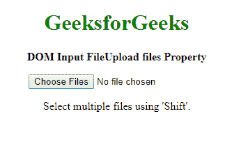

# HTML | DOM 输入文件上传文件属性

> 原文:[https://www . geesforgeks . org/html-DOM-input-file upload-files-property/](https://www.geeksforgeeks.org/html-dom-input-fileupload-files-property/)

HTML DOM 中的**输入文件上传文件属性**用于**返回**一个文件列表对象，代表*用文件上传按钮*选择的一个或多个文件，这是一个只读属性。
通过 FileList 对象，可以获取文件的相关信息。
**语法:**

```html
fileuploadObject.files
```

**返回值:I** t 返回一个代表所选文件的文件列表对象。

**例:**

## 超文本标记语言

```html
<!DOCTYPE html>
<html>

<head>
    <title>
      Input FileUpload files Property
  </title>
</head>

<body onload="myFunction()">
    <center>
        <h1 style="color: green">
          GeeksforGeeks
      </h1>

<p>
            <b>
            DOM Input FileUpload files Property
          </b>
        </p>

        <input type="file"
               id="myFile"
               multiple size="50"
               onchange="myFunction()">

        <p id="demo"></p>

        <script>
            function myFunction() {
                var GFG =
                    document.getElementById("myFile");
                var msg = "";
                if ('files' in GFG) {
                    if (GFG.files.length == 0) {
                        msg =
                            "Select multiple files using" +
                            " 'Shift'.";
                    } else {
                        for (var i = 0; i < GFG.files.length; i++) {

                            msg += "<br><strong>" + (i + 1) +
                                ". file</strong><br>";

                            var file = GFG.files[i];
                            if ('name' in file) {
                                msg += "name: " + file.name + "<br>";
                            }
                            if ('size' in file) {
                                msg += "size: " + file.size +
                                    " bytes <br>";

                            }
                        }
                    }
                } else {
                    if (GFG.value == "") {
                        msg += "Select multiple" +
                          " files using 'Shift'.";

                    } else {
                        msg += "This file property" +
                          " is not supported!!";

                        /* If the browser does not
                        support the files property,
                        it will return the path of
                        the selected file instead. */
                        msg += "<br>The path of the " +
                          "selected file: " + GFG.value;
                    }
                }
                document.getElementById("demo").innerHTML = msg;
            }
        </script>
    </center>
</body>

</html>
```

**输出:**
**前:**



**之后:**


**支持的浏览器:**

*   谷歌 Chrome
*   边缘
*   Mozilla Firefox
*   歌剧
*   旅行队