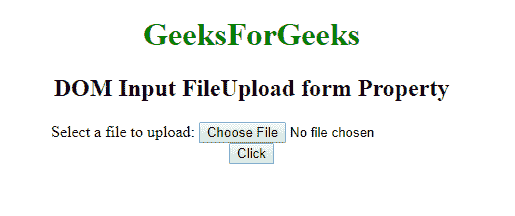
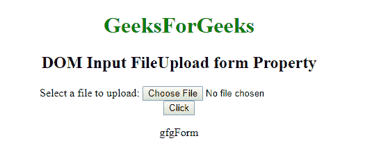

# HTML | DOM 输入文件上传表单属性

> 原文:[https://www . geesforgeks . org/html-DOM-input-file upload-form-property/](https://www.geeksforgeeks.org/html-dom-input-fileupload-form-property/)

HTML DOM 中的**输入文件上传表单属性**用于**返回** *对包含文件上传按钮*的表单的引用。这是一个只读属性，成功时返回一个 form 对象。
**语法:**

```html
fileuploadObject.form
```

**返回值**:返回一个字符串值，指定包含输入文件上传字段的表单的引用

**例:**

## 超文本标记语言

```html
<!DOCTYPE html>
<html>

<head>
    <title>
        DOM Input FileUpload form Property
    </title>
</head>

<body>
    <center>
        <h1 style="color:green;"> 
                GeeksForGeeks 
            </h1>

        <h2>
          DOM Input FileUpload form Property
      </h2>
        <form id="gfgForm">
            Select a file to upload:
            <input type="file"
                   id="myFile">
        </form>

        <button onclick="myFunction()">
          Click
      </button>

        <p id="demo">
      </p>

        <script>
            function myFunction() {
                var frmid =
                    document.getElementById(
                  "myFile").form.id;

                document.getElementById(
                  "demo").innerHTML = frmid;
            }
        </script>
    </center>
</body>

</html>
```

**输出:**
**前:**



**之后:**



**支持的浏览器:**T2 DOM 输入文件上传表单属性支持的浏览器如下:

*   谷歌 Chrome
*   Internet Explorer 10.0 +
*   火狐浏览器
*   歌剧
*   旅行队