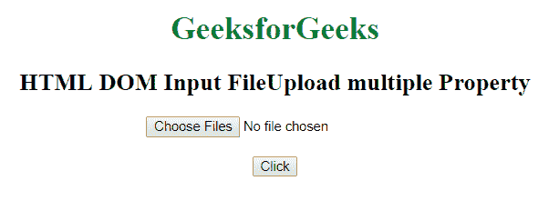
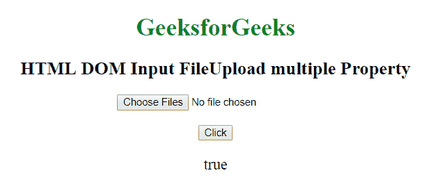
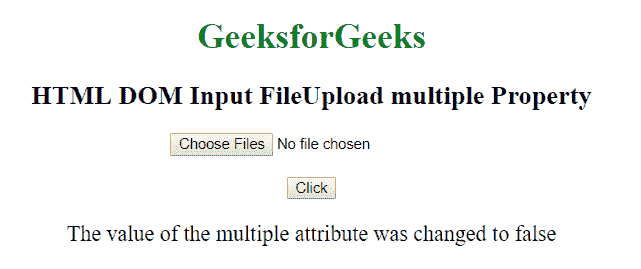

# HTML | DOM 输入文件上传多个属性

> 原文:[https://www . geesforgeks . org/html-DOM-input-file upload-multi-property/](https://www.geeksforgeeks.org/html-dom-input-fileupload-multiple-property/)

HTML DOM 中的**输入文件上传多个属性**用于设置或返回用文件上传按钮选择的一个或多个文件。它包含一个布尔值，当允许用户选择多个文件时，该值为真。此属性用于反映 HTML 多重属性。

**语法:**

*   它返回输入文件上传多个属性。

    ```html
    fileuploadObject.multiple
    ```

*   它用于设置输入文件上传多个属性。

    ```html
    fileuploadObject.multiple = true|false
    ```

**属性值:**

*   **true:** 允许用文件上传按钮选择多个文件。
*   **False:** 不允许用文件上传按钮选择多个文件。

**返回值:**返回一个布尔值，指定是否允许用户使用文件上传按钮选择多个文件。

**例 1:**

```html
<!DOCTYPE html> 
<html> 

<head> 
    <title> 
        HTML DOM Input FileUpload multiple Property
    </title> 
</head> 

<body style="text-align:center;"> 

    <h1 style="color:green;"> 
        GeeksforGeeks 
    </h1> 

    <h2>
        HTML DOM Input FileUpload multiple Property
    </h2>

    <input type="file" id="geeks" multiple> 

    <br><br>

    <button onclick="myFunction()"> 
        Click 
    </button> 

    <p id="GFG" style="Font-size:20px;"></p> 

    <script> 
        function myFunction() { 
            var x = document.getElementById("geeks").multiple; 

            document.getElementById("GFG").innerHTML = x; 
        } 
        </script> 
    </center> 
</body> 

</html>
```

**输出:**

*   **点击按钮前:**
    
*   **点击按钮后:**
    

**例 2:**

```html
<!DOCTYPE html> 
<html> 

<head> 
    <title> 
        HTML DOM Input FileUpload multiple Property
    </title> 
</head> 

<body style="text-align:center;"> 

    <h1 style="color:green;"> 
        GeeksforGeeks 
    </h1> 

    <h2>
        HTML DOM Input FileUpload multiple Property
    </h2>

    <input type="file" id="geeks" multiple> 

    <br><br>

    <button onclick="myFunction()"> 
        Click 
    </button> 

    <p id="GFG" style="Font-size:20px;"></p> 

    <script> 
        function myFunction() { 
            var x = document.getElementById("geeks").multiple
                    = "false"; 

            document.getElementById("GFG").innerHTML 
                    = "The value of the multiple attribute"
                    + " was changed to " + x; 
        } 
    </script> 
</body> 

</html>
```

*   **点击按钮前:**
    
*   **点击按钮后:**
    

**支持的浏览器:**HTML DOM 输入文件支持的浏览器上传多个属性如下:

*   谷歌 Chrome
*   Internet Explorer 10.0
*   火狐浏览器
*   旅行队
*   歌剧