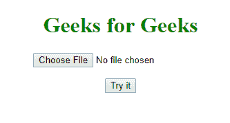
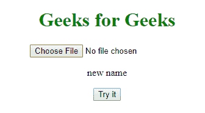

# HTML | DOM 输入文件上传名称属性

> 原文:[https://www . geesforgeks . org/html-DOM-input-file upload-name-property/](https://www.geeksforgeeks.org/html-dom-input-fileupload-name-property/)

**名称属性**用于**设置**或**返回** *文件上传按钮*的名称属性值。
名称属性用于在提交到服务器后识别表单数据。

**语法:**

*   **返回名称属性:**

    ```html
    fileuploadObject.name
    ```

*   **设置名称属性:**

    ```html
    fileuploadObject.name=name
    ```

**属性值:**

*   **名称:**指定文件上传按钮的名称。

**示例-1:** 返回“名称”属性。

```html
<!DOCTYPE html>
<html>

<head>
    <style>
        h1 {
            color: green;
        }
    </style>
</head>

<body>
  <center>
    <h1>
      Geeks for Geeks
  </h1>

    <input type="file"
           id="myFile" 
           name="gfgFile">

    <p id="demo"></p>

    <button onclick="myFunction()">
        Click
    </button>

    <script>
        function myFunction() {
            var x =
                document.getElementById("myFile").name;
            document.getElementById("demo").innerHTML = x;
        }
    </script>
  </center>
</body>

</html>
```

**输出:**
**前:**

**后:**


**示例-2:** 设置**的【名称】**属性。

```html
<!DOCTYPE html>
<html>

<head>
    <style>
        h1 {
            color: green;
        }
    </style>
</head>

<body>
    <center>
    <h1>
      Geeks for Geeks
  </h1>
        <input type="file"
               id="myFile">

        <p id="demo"></p>

        <button onclick="myFunction()">
            Try it
        </button>

        <script>
            function myFunction() {
                var x =
                    document.getElementById(
                        "myFile").name = "new name";

                document.getElementById("demo").innerHTML = x;
            }
        </script>
    </center>

</body>

</html>
```

**输出:**
**前:**

**后:**


**支持的浏览器:**

*   谷歌 Chrome
*   Mozilla Firefox
*   Edge 10.0
*   歌剧
*   苹果 Safari