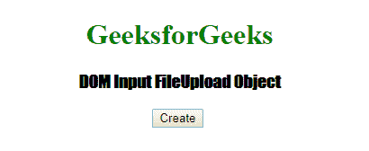

# HTML | DOM 输入文件上传对象

> 原文:[https://www . geesforgeks . org/html-DOM-input-file upload-object/](https://www.geeksforgeeks.org/html-dom-input-fileupload-object/)

**DOM 输入文件上传对象**代表*HTML 表单的输入类型，即“文件”*。这用于启用将文件上传到网站的用户侧功能。

**语法:**

```html
document.getElementById("ID")
```

“标识”将被分配给输入元素。

**属性值:**

*   **accept:** 该属性用于设置或返回文件上传按钮的 accept 属性值
*   **自动对焦:**此属性用于设置或返回文件上传按钮是否应在页面加载时自动对焦
*   **默认值:**该属性用于设置或返回文件上传按钮的默认值
*   **禁用:**该属性用于设置或返回文件上传按钮是否禁用
*   **文件:**该属性用于返回一个 FileList 对象，该对象代表用文件上传按钮选择的一个或多个文件
*   **表单:**该属性用于返回对包含文件上传按钮的表单的引用
*   **multiple:** 此属性用于设置或返回是否允许用户在文件上传字段中选择多个文件
*   **名称:**该属性用于设置或返回文件上传按钮的名称属性值
*   **必选:**该属性用于设置或返回提交表单前是否必须选择文件上传字段中的文件
*   **类型:**该属性用于返回文件上传按钮是哪种类型的表单元素
*   **值:**该属性用于返回所选文件的路径或名称

以下示例显示了文件上传的工作方式。
**示例-1:** 通过文件上传对象上传文件

```html
<!DOCTYPE html>
<html>

<head>
    <title>
      DOM Input FileUpload Object
  </title>
    <style>
        h1 {
            color: green;
        }

        h3 {
            font-family: Impact;
        }

        body {
            text-align: center;
        }
    </style>
</head>

<body>
    <h1>
      GeeksforGeeks
  </h1>
    <h3>
      DOM Input FileUpload Object
  </h3>

    <input type="file"
           id="myFile">
    <p id="submit_text">
  </p>

    <p>
      Click the "Upload" button 
      to disable the file upload button.
  </p>

    <button onclick="myFunction()">
      Upload
  </button>

    <script>
        function myFunction() {

            var x = document.getElementById("myFile");
            x.disabled = true;

            var y = document.getElementById(
              "submit_text").innerHTML = 
                "Thank you For Submitting";
        }
    </script>

</body>

</html>

</body>

</html>
```

**输出:**
**前:**

**后:**


**示例-2:** 创建<输入>元素类型=文件。

```html
<!DOCTYPE html>
<html>

<head>
    <title>
        DOM Input FileUpload Object
    </title>
    <style>
        h1 {
            color: green;
        }

        h3 {
            font-family: Impact;
        }

        body {
            text-align: center;
        }
    </style>
</head>

<body>

    <h1>
      GeeksforGeeks
  </h1>
    <h3>
      DOM Input FileUpload Object
  </h3>

    <button onclick="myFunction()">
      Create
  </button>
    <br>
    <script>
        function myFunction() {

            var x = 
                document.createElement("INPUT");
            x.setAttribute("type", "file");
            document.body.appendChild(x);
        }
    </script>

</body>

</html>
```

**输出:**
**前:**

**后:**


**支持的浏览器:**

*   谷歌 Chrome
*   边缘
*   Mozilla Firefox
*   歌剧
*   旅行队